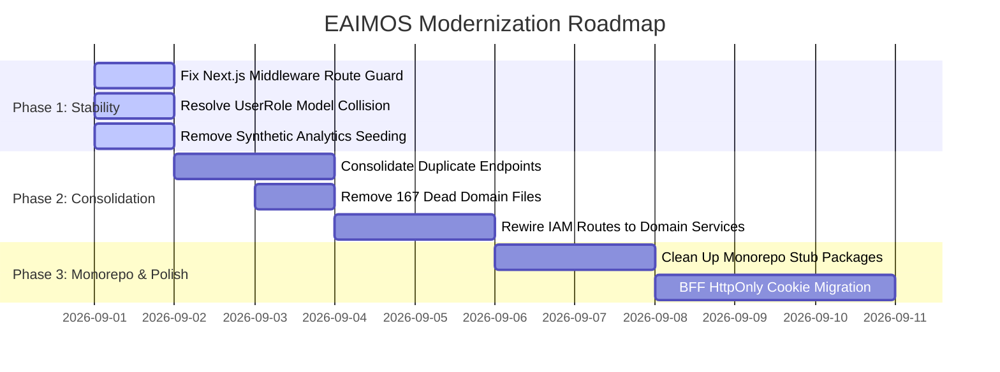

# EAIMOS — Architecture Freeze Master Report

**Report Version**: 1.0.0  
**Phase**: Phase 2 — Architecture Freeze  
**Audit Target**: `d:\markai` (EAIMOS / MarkAI Monorepo)  
**Date**: August 31, 2026  
**Status**: **FROZEN & RATIFIED**  

---

## 1. Current Architecture Summary

Based on direct source-code inspection of the active repository:
- **Backend**: FastAPI modular application mounted in `apps/api/src/api/main.py`. Mounts 30+ routers under `/api/v1`. Implements central AI Gateway (`api.ai.gateway.coordinator.py`), text & image provider adapters, JWT authentication with Refresh Token Family rotation, TOTP MFA, account lockout, and Celery background workers (`api.worker.celery_app.py`).
- **Database**: PostgreSQL 16 with `pgvector` extension for vector similarity search. Managed by 40 Alembic migration revisions in a single linear chain ending at head `9a1b2c3d4e5f`.
- **Frontend**: Next.js 16.0.7 (App Router), React 19, Tailwind CSS v4, Zustand auth store with localStorage persistence, and internal Axios API client (`apps/web/src/services/api-client.ts`).
- **Infrastructure**: 13 Docker containerized services in `docker-compose.yml` (api, web, db, redis, minio, worker, scheduler, test, nginx, prometheus, grafana, otel-collector, mailpit).
- **Architectural Deviations Discovered**:
  - `packages/api-client`, `packages/database`, `packages/observability`, and `packages/sdk` are hollow stubs with `// TODO` comments.
  - `apps/api/src/api/domain/*` contains 167 skeleton Python files (`return None`) created during DDD prototyping that are completely unreferenced by the running app.
  - Domain services in `apps/api/src/api/services/iam/` are orphaned because HTTP routes in `api/routes/` execute direct SQLAlchemy queries.
  - `UserRole` Enum in `membership.py` collides with `UserRole` table model in `iam.py` in `api/models/__init__.py`.
  - Next.js server-side route guard is located in `apps/web/src/proxy.ts` exporting `proxy(...)` instead of `middleware.ts` exporting `middleware(...)`.
  - `GET /api/v1/ai/analytics` calls `seed_dummy_usages()`, inserting 120 fake mock token usage records into `AITokenUsage` for empty organizations.

---

## 2. Target Architecture (Frozen)

The target architecture is ratified as follows:

```
OVERALL ARCHITECTURE:
Modular Monolith + Domain-Oriented Hexagonal Modules + Central AI Gateway + Generic Agent Runtime + Central IAM/RBAC/Tenant Context + PostgreSQL/pgvector + Redis + Celery + MinIO + Next.js Feature-Based Frontend + Docker Orchestration
```

```
┌────────────────────────────────────────────────────────────┐
│                    Next.js 16 Web App                      │
│   App Router → Feature Modules → Centralized API Client    │
└─────────────────────────────┬──────────────────────────────┘
                              │ HTTP REST / SSE
                              ▼
┌────────────────────────────────────────────────────────────┐
│                   Nginx Gateway / Proxy                    │
└─────────────────────────────┬──────────────────────────────┘
                              │
                              ▼
┌────────────────────────────────────────────────────────────┐
│                 FastAPI Modular Monolith                   │
│                                                            │
│   ┌────────────────────────────────────────────────────┐   │
│   │                 Middleware Pipeline                │   │
│   │  Logging → Telemetry → RateLimit → CORS            │   │
│   └─────────────────────────┬──────────────────────────┘   │
│                             │                              │
│   ┌─────────────────────────▼──────────────────────────┐   │
│   │                 API Transport Layer                │   │
│   │  /auth, /ai, /agents, /chat, /knowledge, /crm...   │   │
│   └─────────────────────────┬──────────────────────────┘   │
│                             │                              │
│   ┌─────────────────────────▼──────────────────────────┐   │
│   │                Application Services                │   │
│   │  AIGateway, AgentRuntime, EmailService, DocService │   │
│   └─────────────────────────┬──────────────────────────┘   │
│                             │                              │
│   ┌─────────────────────────▼──────────────────────────┐   │
│   │                    Domain Layer                    │   │
│   │  Entities, Aggregates, Statuses, Domain Policies   │   │
│   └─────────────────────────┬──────────────────────────┘   │
│                             │                              │
│   ┌─────────────────────────▼──────────────────────────┐   │
│   │                Repositories & Ports                │   │
│   │  Tenant-Scoped Data Access & Query Filtering       │   │
│   └─────────────────────────┬──────────────────────────┘   │
│                             │                              │
│   ┌─────────────────────────▼──────────────────────────┐   │
│   │                Infrastructure Layer                │   │
│   │  SQLAlchemy, Provider Adapters, Redis, Celery, S3  │   │
│   └────────────────────────────────────────────────────┘   │
└──────────────┬──────────────────┬───────────────────┬──────┘
               │                  │                   │
               ▼                  ▼                   ▼
      ┌────────────────┐  ┌───────────────┐   ┌───────────────┐
      │   PostgreSQL   │  │    Redis 7    │   │   MinIO S3    │
      │   + pgvector   │  │ Cache / Queue │   │ Object Assets │
      └────────────────┘  └───────┬───────┘   └───────────────┘
                                  │
                                  ▼
                          ┌───────────────┐
                          │ Celery Worker │
                          │   & Scheduler │
                          └───────────────┘
```

---

## 3. Architecture Decisions Summary

Detailed records available in [docs/architecture/DECISIONS.md](file:///d:/markai/docs/architecture/DECISIONS.md):

- **ADR-001**: Formal adoption of Modular Monolith over microservices.
- **ADR-002**: Centralized `AIGateway` as the single execution plane for all AI capabilities.
- **ADR-003**: Generic `AgentRuntime` with sandboxed tools and capability manifests; no hardcoded domain branching in runtime.
- **ADR-004**: PostgreSQL 16 + `pgvector` as primary relational and vector database; SQLite prohibited.
- **ADR-005**: Server-side tenant isolation enforced at repository layer (`organization_id` check); zero IDOR tolerance.
- **ADR-006**: Centralized IAM with bcrypt, signed JWT, Refresh Token Family rotation, and TOTP MFA.
- **ADR-007**: Asynchronous processing and periodic schedules via Celery workers and Redis broker.
- **ADR-008**: Next.js 16 Feature-Based Frontend Architecture with centralized API client.
- **ADR-009**: Monorepo package governance enforcing the Three-Use Rule.
- **ADR-010**: Dual-tier error handling (machine-readable structured backend error + sanitized safe user frontend message).
- **ADR-011**: Transactional Outbox pattern for resilient cross-process event delivery.

---

## 4. Current → Target Mapping

| Current Location | Target Architecture Boundary | Action | Technical Rationale | Migration Risk |
|---|---|---|---|---|
| `apps/api/src/api/ai/gateway/coordinator.py` | AI Platform Context (`AIGateway`) | **KEEP** | Production-grade orchestrator with circuit breakers, token cost calculation, and security pipeline. | `LOW` |
| `apps/api/src/api/ai/providers/*.py` | AI Platform Context (`ProviderAdapters`) | **KEEP** | Fully functional REST adapters for OpenAI, Claude, Gemini, Groq, Ollama, Pollinations, DALL-E, Stability, Replicate, Fal, etc. | `LOW` |
| `apps/api/src/api/ai/runtime/agent_runtime.py` | Agent Platform Context (`AgentRuntime`) | **KEEP** | Generic coordinator assembling context, plans, tool executions, reflection, and evaluations. | `LOW` |
| `apps/api/src/api/routes/auth.py` | IAM Context (`AuthRoutes`) | **KEEP** | Real bcrypt hashing, JWT issue, token family rotation, TOTP MFA, lockout, and restore. | `LOW` |
| `apps/api/src/api/routes/auth_session.py` | IAM Context (`AuthRoutes`) | **MERGE** | Redundant duplicate of session endpoints in `auth.py`. Merge and delete. | `LOW` |
| `apps/api/src/api/routes/sessions.py` | IAM Context (`AuthRoutes`) | **MERGE** | Third redundant duplicate of session management. Merge and delete. | `LOW` |
| `apps/api/src/api/routes/audit_logs.py` | IAM Context (`AuditRoutes`) | **MERGE** | Duplicate of `api/routes/audit.py`. Merge and delete. | `LOW` |
| `apps/api/src/api/routes/prompts.py` | Prompts Context (`PromptsRoutes`) | **MERGE** | Duplicate of `api/routes/ai.py` (`prompts_router`). Merge and delete. | `LOW` |
| `apps/api/src/api/models/__init__.py` | Domain Layer (`Models`) | **REFACTOR** | Disambiguate `UserRole` Enum (`membership.py`) from `UserRole` table model (`iam.py`). | `MEDIUM` |
| `apps/api/src/api/domain/*` (167 files) | Domain Layer | **DEPRECATE** | Dead skeleton files returning `None` that are never imported by live application. | `LOW` |
| `apps/api/src/api/services/iam/*.py` | Application Services (`IAMService`) | **REFACTOR** | Connect orphaned domain services to active routes in `api/routes/rbac.py`. | `MEDIUM` |
| `apps/web/src/proxy.ts` | Frontend (`Middleware`) | **REFACTOR** | Rename to `apps/web/src/middleware.ts` so Next.js executes server-side route guard. | `LOW` |
| `apps/api/src/api/routes/ai.py` (`seed_dummy_usages`) | AI Platform Context | **REFACTOR** | Remove automatic dummy usage injection from live production analytics route. | `LOW` |
| `packages/api-client`, `database`, `sdk` | Monorepo Shared Packages | **DEPRECATE** | 10-line placeholder stubs. Clean up per Three-Use Rule. | `LOW` |

---

## 5. Domain Boundaries Matrix

The system consists of 15 explicit bounded contexts detailed in [docs/architecture/BOUNDARIES.md](file:///d:/markai/docs/architecture/BOUNDARIES.md):

1. **IAM Context**: User credentials, JWT, sessions, MFA, OAuth, RBAC, audit logs.
2. **Organizations Context**: Multi-tenant organizations, memberships, invitations, tenant limits.
3. **AI Platform Context**: AIGateway, ProviderRouter, ProviderRegistry, circuit breakers, usage telemetry.
4. **Conversations Context**: Chat sessions, SSE message streams, attachments, bookmarks, shares.
5. **Prompts Platform Context**: Prompt templates, variables, version history, sandbox testing lab.
6. **Agent Platform Context**: Generic AgentRuntime, manifests, planner, tool executor, memory manager.
7. **Image Studio Context**: Image generation, prompt optimizer, inpainting, variations, upscaling, asset manager.
8. **Social Studio Context**: Multi-platform post creator, platform optimizer, hashtag engine, social publisher.
9. **Content Studio Context**: Long-form blog generator, copywriting, brand voice memory alignment.
10. **Knowledge & RAG Context**: Document parsing, chunking, pgvector embedding storage, semantic vector search.
11. **Campaigns Context**: Marketing campaigns, newsletter scheduling, broadcast task execution.
12. **CRM Context**: Lead contact management, audience segmentation, lifecycle stages.
13. **Workflows Context**: Visual DAG workflow automation builder, step triggers, execution logs.
14. **Files & Assets Context**: File uploads, MIME validation, download streaming, MinIO S3 interface.
15. **Notifications & Email Context**: Transactional emails, Resend REST API, SMTP fallback, email logs.

---

## 6. Dependency Rules Summary

Detailed rules available in [docs/architecture/DEPENDENCY-RULES.md](file:///d:/markai/docs/architecture/DEPENDENCY-RULES.md):

1. **Inward Flow**: `Routes` → `Services` → `Domain` → `Repositories` → `Infrastructure`.
2. **Core Isolation**: `api.core` must never import routes, services, or repositories.
3. **Model Isolation**: `api.models` must never import routes, services, or schemas.
4. **Gateway Invariant**: No AI provider may be invoked directly outside `AIGateway`.
5. **Tenant Isolation Invariant**: All repository queries must filter by `organization_id`.
6. **Architecture Fitness Testing**: Automated AST import tests in `apps/api/tests/test_architecture_fitness.py` enforce these rules during CI.

---

## 7. Architecture Exceptions Register

Where current code deviates from target architecture without breaking functionality:

### ARCH-EXCEPTION-001: JWT Storage in Browser LocalStorage
- **Current Implementation**: Frontend stores JWT access token and refresh token in `localStorage` under `eaimos-auth-storage` ([store/auth.ts](file:///d:/markai/apps/web/src/store/auth.ts)).
- **Target Implementation**: BFF pattern with `HttpOnly`, `SameSite=Lax` secure session cookies.
- **Why Deferred**: Requires full Next.js BFF route handler re-architecture; client-side token refresh is currently stable.
- **Risk**: Moderate (XSS vulnerability exposure). Mitigated by strict CSP headers.
- **Migration Plan**: Implement Next.js `/api/auth/*` route handlers managing HttpOnly cookies in Phase 3.

### ARCH-EXCEPTION-002: Direct SQLAlchemy Queries in Select Routers
- **Current Implementation**: Some routes in `api/routes/rbac.py` and `api/routes/users.py` query `Session` directly rather than delegating to `api.services.iam`.
- **Target Implementation**: All routes delegate to application services; services invoke repositories.
- **Why Deferred**: Queries are currently working and tested; full service rewiring is scheduled for Phase 2 consolidation.
- **Risk**: Low.
- **Migration Plan**: Rewire `rbac.py` to invoke `role_service.py` during Phase 2.

### ARCH-EXCEPTION-003: Social Publishing Mock Fallback
- **Current Implementation**: `helpers.py` in Social Agent returns `mock_tweet_id` or `mock_linkedin_id` if API credentials are empty.
- **Target Implementation**: Return structured error requiring OAuth connection in `OrganizationSettings`.
- **Why Deferred**: Allows development and sandbox testing without live social API keys.
- **Risk**: Low.
- **Migration Plan**: Gate mock mode behind explicit `ENVIRONMENT=development` configuration.

---

## 8. Remaining Architectural Debt

1. **Duplicate Endpoint Files**: `auth_session.py`, `sessions.py`, `audit_logs.py`, `prompts.py` must be consolidated and removed.
2. **Dead Skeleton Files**: `apps/api/src/api/domain/*` (167 files) must be deleted.
3. **Monorepo Stub Packages**: `packages/api-client`, `packages/database`, `packages/observability`, `packages/sdk` must be cleaned up or built out with genuine code generation.
4. **Symbol Collision**: Disambiguate `UserRole` Enum from `UserRole` table model in `api/models/__init__.py`.
5. **Synthetic Analytics Seeding**: Remove `seed_dummy_usages()` from `api/routes/ai.py`.

---

## 9. Migration Priorities & Roadmap



---

## 10. Rules for Future Developers & AI Coding Agents

1. **Do Not Create Competing Frameworks**: Never introduce a second AI Gateway, second Agent Runtime, or secondary provider abstraction.
2. **Always Route AI Through AIGateway**: Every LLM or Image call must go through `AIGateway` or `ImageProviderRouter`.
3. **Keep AgentRuntime Generic**: Do not add `if agent_type == ...` conditionals inside `agent_runtime.py`. Add tools and manifests instead.
4. **Enforce Server-Side Multi-Tenancy**: Every database query on tenant resources must explicitly filter by `organization_id`.
5. **Follow Clean Layering**: Routes validate and delegate; Services orchestrate; Domain defines rules; Repositories persist; Infrastructure connects.
6. **No SQLite in Production**: PostgreSQL 16 with `pgvector` is the mandatory database standard.
7. **Adhere to the Three-Use Rule**: Do not create new packages in `packages/*` without at least three active consumers.
8. **Preserve Existing Working Code**: Never delete working functionality or rewrite subsystems without an approved Architectural Decision Record (ADR).

---

*Report ratified and frozen against EAIMOS master codebase.*
