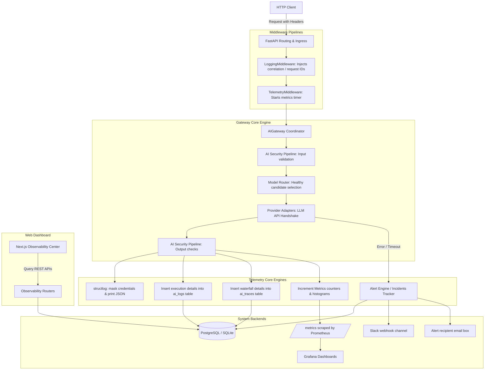

# Enterprise AI Platform: Observability Architecture

This document details the high-level architecture, trace propagation, and metrics collection flows for Viptant's observability suite.

## High-Level Telemetry Flow

The diagram below maps the path of a gateway request, showing how telemetry contexts propagate to structured databases, Prometheus registries, and active incident workflows:

## Trace Propagation Details

Trace IDs are passed along all systems:
1. **HTTP Layer**: Headers `x-correlation-id`, `x-request-id`, and `x-trace-id` track request scopes.
2. **Context Propagation**: Standard context variables (`contextvars`) propagate trace boundaries inside async tasks, ensuring SQLite and Postgres database records are linked back to the originating user request.
3. **Task Queues**: Celery task headers propagate correlation identifiers, linking asynchronous offline tasks to active user trace trees.
4. **Third-Party Providers**: Latencies, token quantities, and response codes are logged under the provider adapter sub-spans.
