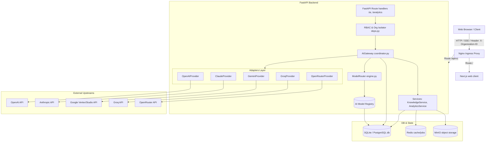
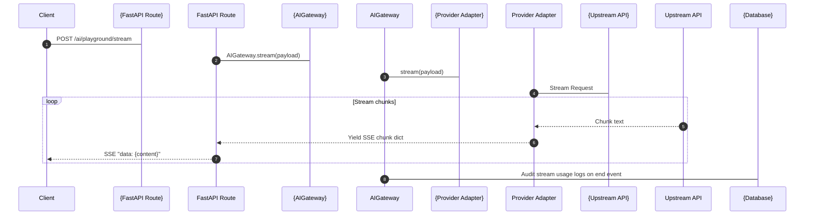

# Viptant Enterprise AI Platform
## Technical Implementation Documentation & Codebase Audit

This document is the official implementation reference and single source of truth for the **Viptant Enterprise AI Platform** module. It reflects the exact state of the production codebase, detailing both frontend and backend architectures, database models, adapters, dynamic routing controllers, telemetry systems, security measures, and development configurations.

---

## 1. Overview
The **Viptant Enterprise AI Platform** is a unified, multi-tenant orchestrator designed to handle all AI and Large Language Model (LLM) operations within the Viptant Enterprise AI Marketing Operating System. 

### Purpose
The module acts as an intelligent intermediary layer that:
* Decouples other business components (such as content generators, CRM workflows, agent memory managers, and campaign runners) from direct provider SDK dependencies.
* Enforces strict multi-tenant data isolation by dynamically loading and decrypting organization-specific API keys.
* Optimizes resource allocation by evaluating dynamic cost/latency routing rules.
* Resists external upstream provider failures via automated fallback handlers and health trackers.

### Architecture
The platform is organized into three major layers:
1. **API Endpoints & Controllers**: Under `apps/api/src/api/routes/ai.py` and `analytics.py`, exposing RESTful handles for conversation histories, prompt templates, telemetry reporting, and model/provider setups.
2. **Gateway Orchestrator & Router Engine**: Sitting at `apps/api/src/api/ai/gateway/coordinator.py` and `router/engine.py`. This orchestrates execution flows, embeds text chunks for RAG queries, evaluates active routing candidates, logs token consumption audits, and runs automatic fallback failovers.
3. **Provider Adapters**: Under `apps/api/src/api/ai/providers/`, implementing the unified `BaseLLMProvider` interface to translate abstract payloads into specific upstream requests.

### How Other Modules Use It
Modules like the **Content Generator** or **Agent Executor** communicate exclusively with the `AIGateway` using standardized methods:
* `AIGateway.chat()` for synchronous message completions.
* `AIGateway.stream()` for server-sent event (SSE) streaming.
* `AIGateway.embeddings()` for text vectorizations.
* `AIGateway.vision()` for multimodal analysis.
* `AIGateway.json_output()` for schema-validated structured objects.

---

## 2. Architecture Diagram

The diagram below maps the runtime architecture and data flow from the client browser through the gateway to database state storage and external API providers.



---

## 3. Folder Structure

The implementation spans both frontend and backend repositories as detailed below:

### Frontend: `apps/web/src/features/ai-platform/`
* **`components/`**
  * [`routing-diagram.tsx`](file:///d:/markai/apps/web/src/features/ai-platform/components/routing-diagram.tsx): Visualizes active request paths to provider nodes using SVG and `framer-motion`.
  * [`inspector-dialog.tsx`](file:///d:/markai/apps/web/src/features/ai-platform/components/inspector-dialog.tsx): Diagnostic panel displaying headers, raw request payloads, prompt templates, and response parameters.
  * [`badges.tsx`](file:///d:/markai/apps/web/src/features/ai-platform/components/badges.tsx): Status indicators.
  * [`export-button.tsx`](file:///d:/markai/apps/web/src/features/ai-platform/components/export-button.tsx): CSV export for telemetry logs.
  * [`filter-panel.tsx`](file:///d:/markai/apps/web/src/features/ai-platform/components/filter-panel.tsx): Advanced filters for logs.
  * [`model-card.tsx`](file:///d:/markai/apps/web/src/features/ai-platform/components/model-card.tsx) / [`provider-card.tsx`](file:///d:/markai/apps/web/src/features/ai-platform/components/provider-card.tsx): Cards displaying metadata and state.
  * [`token-counter.tsx`](file:///d:/markai/apps/web/src/features/ai-platform/components/token-counter.tsx): Graphic indicators representing prompt/completion sizes.
* **`hooks/`**
  * [`index.ts`](file:///d:/markai/apps/web/src/features/ai-platform/hooks/index.ts): Custom React Query hooks managing data integration (`useModels`, `useProviders`, `useUsage`, `useAnalytics`, `useRouting`, `useProviderLogs`, `useLatency`, `useCosts`, `useProviderHealth`).
* **`pages/`**
  * [`playground.tsx`](file:///d:/markai/apps/web/src/features/ai-platform/pages/playground.tsx): Interactive prompt lab with variables, stream controllers, and parameter sliders.
  * [`compare.tsx`](file:///d:/markai/apps/web/src/features/ai-platform/pages/compare.tsx): Parallel side-by-side model comparison playground.
  * [`admin.tsx`](file:///d:/markai/apps/web/src/features/ai-platform/pages/admin.tsx): Organization settings, limits, credit overrides, keys rotation, and audits.
  * [`analytics.tsx`](file:///d:/markai/apps/web/src/features/ai-platform/pages/analytics.tsx): KPI metrics and forecast graphs.
  * [`health.tsx`](file:///d:/markai/apps/web/src/features/ai-platform/pages/health.tsx): Provider status timeline and error log tracer.
  * [`router.tsx`](file:///d:/markai/apps/web/src/features/ai-platform/pages/router.tsx): Routing rules builder and SVGs flow graph wrapper.
  * [`usage.tsx`](file:///d:/markai/apps/web/src/features/ai-platform/pages/usage.tsx): Logs table view with query diagnostic inspectors.
* **`store/`**
  * [`ai-platform.ts`](file:///d:/markai/apps/web/src/features/ai-platform/store/ai-platform.ts): Zustand store for filters, preferences, favorites, and selections.
* **`types/`**
  * [`index.ts`](file:///d:/markai/apps/web/src/features/ai-platform/types/index.ts): TypeScript interfaces.

### Backend: `apps/api/src/api/ai/`
* **`gateway/`**
  * [`coordinator.py`](file:///d:/markai/apps/api/src/api/ai/gateway/coordinator.py): Core `AIGateway` executor handling RAG contextualization, custom keys mapping, pricing audits, and fallback routing.
* **`router/`**
  * [`engine.py`](file:///d:/markai/apps/api/src/api/ai/router/engine.py): `ModelRouter` evaluating active routing rules.
* **`registry/`**
  * [`manager.py`](file:///d:/markai/apps/api/src/api/ai/registry/manager.py): Seeds database model configurations and tracks active model status.
* **`providers/`**
  * [`base.py`](file:///d:/markai/apps/api/src/api/ai/providers/base.py) / [`openai.py`](file:///d:/markai/apps/api/src/api/ai/providers/openai.py) / [`claude.py`](file:///d:/markai/apps/api/src/api/ai/providers/claude.py) / [`gemini.py`](file:///d:/markai/apps/api/src/api/ai/providers/gemini.py) / [`groq.py`](file:///d:/markai/apps/api/src/api/ai/providers/groq.py) / [`openrouter.py`](file:///d:/markai/apps/api/src/api/ai/providers/openrouter.py): Unified adapter implementations.
* **`tools/`**
  * [`registry.py`](file:///d:/markai/apps/api/src/api/ai/tools/registry.py) / [`crm_tool.py`](file:///d:/markai/apps/api/src/api/ai/tools/crm_tool.py) / [`knowledge_tool.py`](file:///d:/markai/apps/api/src/api/ai/tools/knowledge_tool.py) / [`web_search_tool.py`](file:///d:/markai/apps/api/src/api/ai/tools/web_search_tool.py): Declarative tool-calling adapters mapped to OpenAI function formats.

---

## 4. Database

The database schemas are defined in SQLAlchemy models and mapped via Alembic migrations.

### Table Definitions & Fields

#### 1. `ai_providers` (defined in `ai_platform.py`)
Stores details on supported LLM providers.
* `id` (`UUID`, Primary Key)
* `name` (`String(50)`, Unique, Nullable=False): e.g., `groq`, `openai`, `anthropic`, `google`, `openrouter`.
* `is_active` (`Boolean`, default=True)
* `priority` (`Integer`, default=1)
* **Relationships**:
  * `models`: 1-to-many relationship with `AIModel` (cascade delete).
  * `keys`: 1-to-many relationship with `AIProviderKey` (cascade delete).
  * `health_checks`: 1-to-many relationship with `AIProviderHealth` (cascade delete).

#### 2. `ai_models` (defined in `ai_platform.py`)
Tracks models dynamically registered under providers.
* `id` (`UUID`, Primary Key)
* `provider_id` (`UUID`, Foreign Key to `ai_providers.id`, ondelete="CASCADE", Nullable=False)
* `model_name` (`String(100)`, Unique, Nullable=False): unique upstream ID.
* `context_window` (`Integer`, Nullable=False)
* `input_token_price` (`Numeric(10, 4)`, default=0.0): Price per 1 Million tokens.
* `output_token_price` (`Numeric(10, 4)`, default=0.0): Price per 1 Million tokens.
* `supports_streaming` (`Boolean`, default=True)
* `supports_vision` (`Boolean`, default=False)
* `supports_tools` (`Boolean`, default=False)
* `supports_json` (`Boolean`, default=False)
* `is_active` (`Boolean`, default=True)
* `is_favorite` (`Boolean`, default=False)
* **Relationships**:
  * `provider_rel`: Many-to-1 relationship with `AIProvider`.

#### 3. `ai_provider_keys` (defined in `ai_platform.py`)
Stores tenant custom API keys.
* `id` (`UUID`, Primary Key)
* `provider_id` (`UUID`, Foreign Key to `ai_providers.id`, ondelete="CASCADE", Nullable=False)
* `api_key` (`String(255)`, Nullable=False): Cryptographically encrypted via Fernet.
* `is_active` (`Boolean`, default=True)
* `organization_id` (`UUID`, Foreign Key to `organizations.id`, ondelete="CASCADE", Nullable=True): Nullable signifies a system-wide default key.

#### 4. `ai_provider_health` (defined in `ai_platform.py`)
Historical logs of health checks.
* `id` (`UUID`, Primary Key)
* `provider_id` (`UUID`, Foreign Key to `ai_providers.id`, ondelete="CASCADE", Nullable=False)
* `latency` (`Numeric(10, 2)`, default=0.0)
* `is_healthy` (`Boolean`, default=True)
* `last_checked` (`DateTime(timezone=True)`, default=datetime.utcnow)
* `error_message` (`Text`, Nullable=True)

#### 5. `ai_requests` (defined in `ai_platform.py`)
Audit trail of gateway requests.
* `id` (`UUID`, Primary Key)
* `organization_id` (`UUID`, Foreign Key to `organizations.id`, ondelete="CASCADE", Nullable=False)
* `user_id` (`UUID`, Foreign Key to `users.id`, ondelete="CASCADE", Nullable=False)
* `provider` (`String(50)`, Nullable=False)
* `model` (`String(100)`, Nullable=False)
* `prompt_tokens` (`Integer`, default=0)
* `completion_tokens` (`Integer`, default=0)
* `cost_usd` (`Numeric(10, 6)`, default=0.0)
* `latency_ms` (`Integer`, default=0)
* `status` (`String(20)`, default="success")

#### 6. `ai_usage` (defined in `ai_platform.py`)
Details request tokens statistics.
* `id` (`UUID`, Primary Key)
* `organization_id` (`UUID`, Foreign Key to `organizations.id`, ondelete="CASCADE", Nullable=False)
* `user_id` (`UUID`, Foreign Key to `users.id`, ondelete="CASCADE", Nullable=False)
* `provider` (`String(50)`, Nullable=False)
* `model` (`String(100)`, Nullable=False)
* `prompt_tokens` (`Integer`, default=0)
* `completion_tokens` (`Integer`, default=0)
* `total_tokens` (`Integer`, default=0)
* `cost_usd` (`Numeric(10, 6)`, default=0.0)
* `latency_ms` (`Integer`, default=0)
* `status` (`String(20)`, default="success")
* `error_message` (`Text`, Nullable=True)

#### 7. `ai_costs` (defined in `ai_platform.py`)
Aggregated input/output token cost audits.
* `id` (`UUID`, Primary Key)
* `organization_id` (`UUID`, Foreign Key to `organizations.id`, ondelete="CASCADE", Nullable=False)
* `provider` (`String(50)`, Nullable=False)
* `model` (`String(100)`, Nullable=False)
* `input_tokens` (`Integer`, default=0)
* `output_tokens` (`Integer`, default=0)
* `cost_usd` (`Numeric(10, 6)`, default=0.0)

#### 8. `ai_playground_sessions` (defined in `ai_platform.py`)
Saved chat configurations in the playground sandbox.
* `id` (`UUID`, Primary Key)
* `organization_id` (`UUID`, Foreign Key to `organizations.id`, ondelete="CASCADE", Nullable=False)
* `user_id` (`UUID`, Foreign Key to `users.id`, ondelete="CASCADE", Nullable=False)
* `name` (`String(100)`, default="New Session")
* `provider` (`String(50)`, Nullable=True)
* `model` (`String(100)`, Nullable=True)
* `temperature` (`Numeric(4, 2)`, default=0.70)
* `system_prompt` (`Text`, Nullable=True)
* **Relationships**:
  * `messages`: 1-to-many relationship with `AIPlaygroundMessage` (cascade delete).

#### 9. `ai_playground_messages` (defined in `ai_platform.py`)
Messages logged within playground sessions.
* `id` (`UUID`, Primary Key)
* `session_id` (`UUID`, Foreign Key to `ai_playground_sessions.id`, ondelete="CASCADE", Nullable=False)
* `role` (`String(20)`, Nullable=False): `user`, `assistant`, `system`.
* `content` (`Text`, Nullable=False)

#### 10. `ai_models_registry` (defined in `ai_registry.py`)
System master registry database for standard defaults.
* `id` (`UUID`, Primary Key)
* `provider` (`String(50)`, Nullable=False)
* `model_name` (`String(100)`, Unique, Nullable=False)
* `context_window` (`Integer`, Nullable=False)
* `supports_streaming` (`Boolean`, default=True)
* `supports_vision` (`Boolean`, default=False)
* `supports_json` (`Boolean`, default=False)
* `supports_images` (`Boolean`, default=False)
* `supports_audio` (`Boolean`, default=False)
* `supports_tool_calling` (`Boolean`, default=False)
* `supports_embeddings` (`Boolean`, default=False)
* `input_token_price` (`Numeric(10, 4)`, default=0.0)
* `output_token_price` (`Numeric(10, 4)`, default=0.0)
* `latency` (`Numeric(10, 2)`, default=0.0): average speed.
* `priority` (`Integer`, default=0)
* `is_healthy` (`Boolean`, default=True)
* `organization_id` (`UUID`, Foreign Key to `organizations.id`, ondelete="CASCADE", Nullable=True)
* **Relationships**:
  * `routing_rules`: 1-to-many relationship with `AIRoutingRule`.

#### 11. `ai_routing_rules` (defined in `ai_registry.py`)
Active request-type routing rules.
* `id` (`UUID`, Primary Key)
* `request_type` (`String(50)`, Nullable=False): `chat`, `content`, `embeddings`, `vision`, `json`.
* `model_registry_id` (`UUID`, Foreign Key to `ai_models_registry.id`, ondelete="CASCADE", Nullable=False)
* `is_active` (`Boolean`, default=True)
* `organization_id` (`UUID`, Foreign Key to `organizations.id`, ondelete="CASCADE", Nullable=True): Nullable represents a system default rule.

#### 12. `ai_token_usages` (defined in `ai_usage.py`)
Legacy audit logger used for backwards compatibility.
* `id` (`UUID`, Primary key)
* `organization_id` (`UUID`, Foreign Key to `organizations.id`, ondelete="CASCADE", Nullable=False)
* `user_id` (`UUID`, Foreign Key to `users.id`, ondelete="CASCADE", Nullable=False)
* `provider` (`String(50)`, Nullable=False)
* `model_name` (`String(100)`, Nullable=False)
* `prompt_tokens` (`Integer`, default=0)
* `completion_tokens` (`Integer`, default=0)
* `total_tokens` (`Integer`, default=0)
* `cost_usd` (`Numeric(10, 6)`, default=0.0)
* `latency_ms` (`Integer`, default=0)
* `status` (`String(20)`, default="success")
* `error_message` (`Text`, Nullable=True)

#### 13. `ai_routing_policies` (defined in `router.py`)
Custom dynamic routing rule policies.
* `id` (`UUID`, Primary Key)
* `name` (`String(100)`, Nullable=False)
* `scope` (`String(50)`, default="global")
* `scope_id` (`String(100)`, Nullable=True)
* `request_type` (`String(50)`, default="*")
* `routing_strategy` (`String(50)`, default="balanced")
* `priority` (`Integer`, default=0)
* `conditions` (`JSON`, Nullable=True)
* `is_active` (`Boolean`, default=True)
* `organization_id` (`UUID`, Foreign Key to `organizations.id`, ondelete="CASCADE", Nullable=True)

#### 14. `ai_routing_logs` (defined in `router.py`)
Detailed historical logs of all router decisions.
* `id` (`UUID`, Primary Key)
* `organization_id` (`UUID`, Foreign Key to `organizations.id`, ondelete="CASCADE", Nullable=True)
* `user_id` (`UUID`, Foreign Key to `users.id`, ondelete="CASCADE", Nullable=True)
* `request_type` (`String(50)`, Nullable=False)
* `strategy_used` (`String(50)`, Nullable=False)
* `selected_provider` (`String(50)`, Nullable=False)
* `selected_model` (`String(100)`, Nullable=False)
* `fallback_count` (`Integer`, default=0)
* `retry_count` (`Integer`, default=0)
* `latency_ms` (`Integer`, default=0)
* `cost_usd` (`Numeric(10, 6)`, default=0.0)
* `prompt_tokens` (`Integer`, default=0)
* `completion_tokens` (`Integer`, default=0)
* `success` (`Boolean`, default=True)
* `error_message` (`Text`, Nullable=True)

#### 15. `ai_failover_events` (defined in `router.py`)
Failover and circuit breaker logs.
* `id` (`UUID`, Primary Key)
* `organization_id` (`UUID`, Foreign Key to `organizations.id`, ondelete="CASCADE", Nullable=True)
* `failed_provider` (`String(50)`, Nullable=False)
* `failed_model` (`String(100)`, Nullable=False)
* `fallback_provider` (`String(50)`, Nullable=False)
* `fallback_model` (`String(100)`, Nullable=False)
* `error_message` (`Text`, Nullable=True)
* `retry_attempts` (`Integer`, default=0)

---

## 5. Provider Registry

The platform allows dynamic mapping and tracking of LLM providers.

### Implemented Features
* **PostgreSQL/SQLite Seeding Sync**: Synchronization of active provider metadata (including priority rankings) is completed in `sync_providers_and_models` on endpoint calls.
* **Decrypted Credentials Loading**: Dynamically connects provider definitions to encrypted organization API keys.
* **Diagnostic Check**: Health check endpoint executes provider adapter checks in the background.

### Missing Features
* **Self-Registration UI**: New provider registration (e.g., custom local Ollama gateways) is missing frontend configuration panels. Currently, providers are hardcoded to the five primary adapters (`groq`, `openai`, `anthropic`, `google`, `openrouter`).

### Backend APIs
* `GET /api/v1/ai/providers/` (Retrieves list, runs sync internally)
* `POST /api/v1/ai/providers/` (Add provider)
* `PUT /api/v1/ai/providers/{id}` (Modify provider status/priority)
* `DELETE /api/v1/ai/providers/{id}` (Delete provider)
* `GET /api/v1/ai/providers/{id}/health` (Executes live provider health check)

### Frontend Pages
* `/dashboard/ai/providers` wraps the page code located in `providers.tsx`. Shows provider latency, cost metrics, and capability support checklists. It includes a provider details page (`provider-details.tsx`) displaying historical pings.

### Current Status
* **Operational (Integrated)**: Backed by `ai_providers` table. Local dev mode acts in mock state if provider credentials aren't loaded in the root environment parameters.

---

## 6. Model Registry

Manages model capabilities, pricing configurations, and real-time health mappings.

### Implemented Features
* **Dynamic Seeding**: Automatically seeds a predefined default set of models on empty database detection:
  * `groq`: `openai/gpt-oss-120b` (low-latency versatile), `llama-3.3-70b-versatile`, `llama3-70b-8192`, `llama3-8b-8192`.
  * `openai`: `gpt-4o-mini` (multimodal), `text-embedding-3-small` (vectorizer).
  * `anthropic`: `claude-3-5-sonnet-20240620` (advanced reasoning).
  * `google`: `gemini-1.5-flash` (long-context multimodal).
* **Metadata & Pricing**: Tracks context window size, support attributes (streaming, json, vision, tool calling), and token pricing metrics (per 1 Million tokens).
* **Uptime Check Tracker**: Dynamic toggle mapping in PostgreSQL updates `is_healthy` flag on upstream adapter exceptions.

### Backend APIs
* `GET /api/v1/ai/models/` (List models)
* `PATCH /api/v1/ai/models/{model_id}` (Toggles model parameters)
* `POST /api/v1/ai/models/sync` (Forces database synchronization)
* `PUT /api/v1/ai/models/{id}` (Edits metadata parameters)

### Frontend Pages
* Mapped to `/dashboard/ai/models`. Displays a list of models with favorite status filters and edit metadata options.

### Current Status
* **Operational (Integrated)**: Backed by `ai_models_registry` and `ai_models` database structures.

---

## 7. AI Gateway

Acts as the central router and executor, sitting at `coordinator.py`.

### Gateway Execution Flow
```
Client Request -> Role/Tenant Verification -> Read Seeding Defaults -> 
Evaluate Router Rules -> Select Healthy Candidate (Fallback Chain) -> 
Load Custom Decrypted Key / Env Key -> Execute Upstream Adapter -> 
Calculate Token Cost -> Audit Metrics to Usage Tables -> Return Response to Client
```

### Decryption & Key Lookup
The gateway executes `self._get_provider_adapter(db, provider_name, organization_id)`. It checks if a row matching the active organization exists in `ai_provider_keys`.
* If found, the encrypted token is decrypted via `api.core.encryption.decrypt_key` and used to initialize the provider adapter instance.
* If no organization key is registered, it defaults to the system-wide environment credentials (`OPENAI_API_KEY`, etc.).

### Streaming
The gateway exposes a generator function: `stream(...)` that takes standard message structures and yields server-sent events. Each chunk is streamed to the frontend as a JSON payload containing delta tokens:
```python
yield {"content": content_delta}
```
Accumulated statistics are audited upon stream completion.

### Fallback Failover Controller
If a candidate model raises an API connection check error (e.g., HTTP 429 Rate Limit or 503 Outage):
1. The coordinator catches the exception.
2. It immediately marks `is_healthy = False` for that model in the `ai_models_registry` table.
3. It audits a "failure" log to `ai_usage`.
4. It iterates to the next candidate model in the fallback chain.
5. If all candidates fail, it throws a `RuntimeError`.

---

## 8. Providers

The platform integrates five provider networks via unified class interfaces extending `BaseLLMProvider`.

| Provider | Chat | Streaming | Embeddings | Vision | JSON Mode | Status / Mock Mode |
| :--- | :---: | :---: | :---: | :---: | :---: | :--- |
| **OpenAI** | ✅ | ✅ | ✅ (1536d) | ✅ | ✅ | **Integrated**. Falls back to simulated replies if `OPENAI_API_KEY` is empty. |
| **Claude** | ✅ | ✅ | ❌ | ✅ | ✅ | **Integrated**. Embeddings raise `NotImplementedError`. System messages extracted to Anthropic structure. |
| **Gemini** | ✅ | ✅ | ✅ (1536d) | ✅ | ✅ | **Integrated**. Maps roles to Google API format, configures `responseMimeType`. |
| **Groq** | ✅ | ✅ | ❌ | ❌ | ✅ | **Integrated**. Vision/embeddings raise `NotImplementedError`. Shorter timeout (10s) optimized for speed. |
| **OpenRouter** | ✅ | ✅ | ❌ | ✅ | ✅ | **Integrated**. Unified proxy fallback routing. |

---

## 9. Playground

The prompt playground is implemented in `playground.tsx`.

### Implemented Features
* **Template Library**: Pre-built presets (Draft Marketing Email, React UI Code Generator).
* **System Instruction Panel**: Configurable system instructions panel.
* **Variable Replacer**: Detects tags using `{{variable_name}}` syntax and generates text inputs dynamically. Replacing variables occurs programmatically before sending parameters to the backend stream.
* **Hyperparameter Controls**: Temperature, Top-P, and Max Completion Length controls.
* **AbortController**: A React useRef tracks `AbortController` handles to interrupt response generation.
* **Multi-View Screen**: Toggle tabs display rendering options:
  * *Preview (Markdown)*: Structured HTML preview block.
  * *Code* / *Raw Text*: Mono-spaced textual trace.
  * *Inspector Panel*: Real-time network speed metrics and telemetry logs.

### Frontend API Client
```typescript
fetch('/api/v1/ai/playground/stream', {
  method: 'POST',
  body: JSON.stringify({ messages, model_name, temperature, system_prompt }),
  signal: abortController.signal
})
```

---

## 10. Compare Lab

Allows side-by-side benchmarking of different model outputs.

### UI Configuration
The interface is located at `compare.tsx`. Users can select up to three active models from a checkbox row, enter a test prompt, and click "Run Comparison" to view performance metrics side-by-side.

### Backend Endpoint
Calls `POST /api/v1/ai/compare/` with a payload of `{ prompt, model_names }`.

### Comparison Logic
The backend coordinator executes parallel inferences for each requested model. The response payload returns an array of results containing:
* `response`: Output text
* `latency_ms`: Roundtrip execution speed
* `prompt_tokens` / `completion_tokens` / `cost_usd`
* `status`: success / failure

If a model fails, the gateway records the failure details inside that model's respective grid block, allowing the user to troubleshoot provider reliability directly.

---

## 11. Router

Evaluating dynamic routing rules is handled by `ModelRouter` in `engine.py`.

### Routing Strategies
The engine selects the primary model and fallback chain based on the request type:
1. **Tenant Override**: Searches for a matching rule in `ai_routing_rules` where `organization_id == active_org_id` and `is_active == True`.
2. **Global System Default**: Fallback to a rule where `organization_id == None` and `is_active == True`.
3. **Backup Model List**: Healthy models from `ai_models_registry` are appended to the candidate list sorted by priority.
4. **Global Fail-safe**: If no candidates are found, it defaults to any healthy model supporting streaming.

### Current Status
* **Operational (Integrated)**: Seeding default rules handles routing for standard actions:
  * `chat` -> `llama3-70b-8192` (Groq)
  * `content` -> `llama3-70b-8192` (Groq)
  * `embeddings` -> `text-embedding-3-small` (OpenAI)
  * `vision` -> `gemini-1.5-flash` (Google)
  * `json` -> `claude-3-5-sonnet-20240620` (Anthropic)

---

## 12. Analytics

Tracks telemetry data to monitor system cost, latency, and throughput.

### Backend Implementation
The analytics service (`analytics_service.py`) aggregates logs from the `ai_token_usages` table.
* **Executive Report (`GET /analytics/executive`)**: Returns total token volume, total USD spent, average latency, and ROI index.
* **Usage Trends (`GET /analytics/token-usage`)**: Aggregates token volume and costs grouped by date.

### Frontend Dashboard
The dashboard is located at `analytics.tsx`.
* **KPI Metric Cards**: Displays average response time, success rates, failure ratios, and cost efficiency.
* **Timeline Chart**: Displays accumulated cost trends.
* **Model Capability Radar**: Visualizes speed versus reasoning depth.
* **Load Density Heatmap**: Tracks hourly load density by day of the week.
* **Forecast Chart**: Projects token consumption and cost trends for the next three days.

---

## 13. Usage Tracking

Monitors token consumption and costs across user and organization scopes.

### Tracking Logic
The backend records data in three database tables:
1. `ai_requests`: Mapped to HTTP requests.
2. `ai_usage`: Logs prompt tokens, completion tokens, latency, status, and error logs.
3. `ai_costs`: Logs input/output token costs based on model registry pricing.

### Seeding Dummy Data
For development and demonstration purposes, the backend seeds mock data logs spanning the last 14 days if the usage tables are empty.

### Organization & User Isolation
The usage logs associate each request with `organization_id` and `user_id`. This mapping allows the system to aggregate costs and track quotas for specific users and organizations.

---

## 14. Health Center

Uptime monitoring and error logs tracer page located at `health.tsx`.

### Implemented Features
* **Active Gateways KPI Cards**: Displays operational vs degraded gateways.
* **Uptime Pulse Timelines**: Visualizes historical ping test results.
* **Incident Log**: Displays database exceptions and failover logs.
* **Resolve Incident Trigger**: Allows administrators to acknowledge and resolve active incidents in the UI.

### Current Status
* **Partially Integrated**: Uptime timelines and incident logs use mock data structures. Upstream status checks map to the real database queries returned by `useProviders` hooks.

---

## 15. Admin Console

The administration console is located at `admin.tsx`.

### Implemented Features
* **Tenant Limits & Credits**: Progress bars display organization credit limits and token expenditures.
* **API Keys Registry**: Displays provider keys mask configurations.
* **Key Rotation Trigger**: Simulates rotating API keys with audit logging.
* **Audit Trail**: Logs admin actions, such as credit adjustments and rotated keys.

### Current Status
* **Partially Integrated**: UI actions update local mock states and log mock audit events. Backend API endpoints for key updates exist, but the admin console does not fully interface with them.

---

## 16. Security

Enterprise security controls protect system integration parameters.

* **API Key Encryption**: The `api.core.encryption` helper uses Fernet cryptography to encrypt API keys. The encryption key is derived from the system's `SECRET_KEY` using SHA-256 hashing.
* **Organization Isolation**: The backend uses the `get_active_organization_id` dependency to extract the active organization ID from the `X-Organization-ID` HTTP header. This isolation ensures users can only access models and logs associated with their active organization.
* **Role-Based Access Control (RBAC)**: Endpoint route schemas use `RoleChecker` and `PermissionChecker` dependencies. This validation ensures callers hold authorized corporate roles (`OWNER`, `ADMIN`, `MEMBER`) or specific permissions for the requested resources.

---

## 17. REST APIs

The following table maps the active REST API endpoints to their backend implementations and frontend consumers:

| Method | Endpoint | Purpose | Frontend Consumer | Backend Service / Router |
| :--- | :--- | :--- | :--- | :--- |
| `POST` | `/api/v1/ai/prompts/` | Create prompt template | Prompt library | `PromptService.create_prompt_version` |
| `POST` | `/api/v1/ai/prompts/{name}/update` | Update prompt template | Prompt library | `PromptService.update_prompt_version` |
| `GET` | `/api/v1/ai/prompts/` | List latest templates | Prompt library | `PromptService.list_latest_prompts` |
| `POST` | `/api/v1/ai/prompts/test` | Test prompt in Playground | Playground Page | `AIGateway.chat` |
| `POST` | `/api/v1/ai/conversations/` | Create chat session | Chat feature | `conversations_router` |
| `GET` | `/api/v1/ai/conversations/` | List conversations | Chat feature | `conversations_router` |
| `GET` | `/api/v1/ai/conversations/{id}/messages` | List messages in session | Chat feature | `conversations_router` |
| `POST` | `/api/v1/ai/conversations/{id}/messages` | Post user message & route | Chat feature | `AIGateway.chat` / RAG pipeline |
| `POST` | `/api/v1/ai/knowledge/` | Upload document chunk | RAG setup | `KnowledgeService.upload_document` |
| `POST` | `/api/v1/ai/knowledge/query` | Query similar document chunks | RAG setup | `KnowledgeService.query_similar_chunks` |
| `GET` | `/api/v1/ai/models/` | List registered models | Models Page / Hooks | `ModelRegistryManager.seed_default_models` |
| `PATCH` | `/api/v1/ai/models/{model_id}` | Modify model health / priority | Router / Models | `models_router` |
| `GET` | `/api/v1/ai/routing-rules/` | List active rules | Router Page | `ModelRegistryManager` / rules list |
| `POST` | `/api/v1/ai/routing-rules/` | Create custom routing rule | Router Page | `routing_rules_router` |
| `PATCH` | `/api/v1/ai/routing-rules/{rule_id}` | Update routing rule status | Router Page | `routing_rules_router` |
| `DELETE` | `/api/v1/ai/routing-rules/{rule_id}` | Remove custom routing rule | Router Page | `routing_rules_router` |
| `GET` | `/api/v1/ai/usage/` | List token usage logs | Usage / Analytics | `usage_router` |
| `POST` | `/api/v1/ai/playground/chat` | Playground query inference | Playground Page | `AIGateway.chat` |
| `POST` | `/api/v1/ai/playground/stream` | Playground stream event handler | Playground Page | `AIGateway.stream` |
| `POST` | `/api/v1/ai/compare/` | Run multi-model comparison | Compare Lab Page | `AIGateway.chat` parallel handler |
| `GET` | `/api/v1/analytics/executive` | Executive dashboard summary | Analytics Page | `AnalyticsService.get_executive_summary` |
| `GET` | `/api/v1/analytics/token-usage` | Token usage history trends | Analytics Page | `AnalyticsService.get_token_usage_trends` |

---

## 18. Frontend

### Page Components
1. **`PlaygroundPage` (`playground.tsx`)**: The interactive workspace for writing prompts. Features template loaders, variable parsing, and real-time streaming previewers.
2. **`ComparePage` (`compare.tsx`)**: Side-by-side benchmarking interface to compare output, latency, cost, and token counts.
3. **`AdminPage` (`admin.tsx`)**: Administrative controls for budgets, credentials, rate limits, and audit logs.
4. **`AnalyticsPage` (`analytics.tsx`)**: Aggregates telemetry data into interactive charts and forecast metrics.
5. **`HealthPage` (`health.tsx`)**: Live status tracker displaying gateway ping timelines and open incidents.
6. **`RouterPage` (`router.tsx`)**: Displays the active routing rules registry alongside SVG path visualizations.
7. **`UsagePage` (`usage.tsx`)**: Searchable list of inference logs, with export buttons and metric cards.

### Custom Hooks (`hooks/index.ts`)
* **`useModels()`**: Connects to the model registry and provides mutations to update model health parameters.
* **`useProviders()`**: Compiles provider profiles and calculates average latencies, request rates, and costs.
* **`useUsage()`**: Queries usage statistics and computes key KPI metrics.
* **`useAnalytics()`**: Generates time series data and distribution allocations for dashboard charts.
* **`useRouting()`**: Coordinates CRUD operations for routing rules.
* **`useProviderHealth()`**: Provides mutation handlers to verify provider endpoint connections.
* **`useLatency()`**: Calculates average and p95 latencies.
* **`useCosts()`**: Computes total cost and average cost per request.
* **`useProviderLogs(providerId)`**: Filters logs and compiles health events for specific providers.

### Zustand Stores
* **`useAIPlatformStore` (`store/ai-platform.ts`)**: Manages UI state, search queries, layout preferences, favorite models, and comparison list state.
* **`useAIStore` (`store/ai.ts`)**: Global state manager containing interfaces for providers, rules, usages, and active time filters.

---

## 19. Backend

* **FastAPI Routers**: Exposes endpoints for platform models, routing rules, usage metrics, provider keys, and prompt templates under the `/api/v1` namespace.
* **Services**:
  * `AnalyticsService`: Aggregates usage data, database campaigns, and CRM pipelines to calculate overall ROI.
  * `KnowledgeService`: Handles text chunking, generates embeddings, and performs cosine similarity queries (using native `pgvector` or a Python-based fallback).
  * `PromptService`: Manages prompt templates, category tags, and version history.
  * `LLMGateway`: Generates simulated responses when developer keys are not set.
* **AIGateway Coordinator**: The core orchestration engine that handles RAG query contextualization, custom keys mapping, pricing audits, and fallback routing.
* **Database Base**: Uses SQLAlchemy Declarative base mappings (`Base`) connected to the PostgreSQL/SQLite engine.

---

## 20. Docker

The monorepo orchestration is configured via `docker-compose.yml` in the root directory.

### Services Schema
1. **`db`**: Runs the PostgreSQL engine (configured with the `pgvector` extension) on port `5432`. Health check: `pg_isready -U postgres`.
2. **`redis`**: Cache and background jobs runner on port `6379`. Health check: `redis-cli ping`.
3. **`minio`**: Object storage server (MinIO console on port `9001`, storage API on port `9000`). Health check: checking `/minio/health/live`.
4. **`api`**: Builds the FastAPI app from `./infra/docker/api/Dockerfile` on port `8000`. Health check: checking `/live`.
5. **`web`**: Builds the Next.js app on port `3000`. Health check: checking web dashboard endpoint responses.
6. **`nginx`**: Reverse proxy on port `80` that routes requests to the Next.js client (`/`) and FastAPI server (`/api/v1`).

---

## 21. Configuration

The application is configured using environment variables loaded by Pydantic settings.

### Core Variables (`.env` / `config.py`)
* `SECRET_KEY`: Crytographic token signing and Fernet encrypt key.
* `DATABASE_URL`: Database connection string (`sqlite:///./eaimos.db` for local dev).
* `REDIS_URL`: Redis connection string.
* `MINIO_ENDPOINT`: Object storage API endpoint.

### Provider API Keys
* `OPENAI_API_KEY`: API key for OpenAI integrations.
* `GEMINI_API_KEY`: API key for Gemini integrations.
* `ANTHROPIC_API_KEY`: API key for Anthropic integrations.
* `GROQ_API_KEY`: API key for Groq integrations.

*Note: If api key settings are left empty, the provider adapters automatically run in simulated mock mode for local development.*

---

## 22. Implemented Features

This checklist highlights the fully completed features of the Enterprise AI Platform:
* [x] **Unified Gateway Wrapper (`coordinator.py`)**: Central API call orchestrator.
* [x] **Decrypted Key Mapping**: Resolves tenant-specific encrypted keys.
* [x] **Automatic Failover Routing**: Handles rate limits and outage redirects.
* [x] **Dynamic Models Registry (`ai_models_registry` table)**: Model definition seeding.
* [x] **Dynamic Seeding Rules (`ai_routing_rules` table)**: Maps request categories to default models.
* [x] **Structured JSON Adaptors**: Provider adapters enforce JSON output formats.
* [x] **Playground Prompt Workspace**: A prompt lab with variable replacement, stream controls, and formatting toggles.
* [x] **Compare Lab**: Multi-model benchmarking for latency, cost, and tokens.
* [x] **RAG Pipeline Contextualizer**: Generates embeddings, indexes text chunks, and appends reference sources to completions.
* [x] **Docker Compose Orchestration**: Configures DB, Redis, MinIO, API, Web, and Nginx.

---

## 23. Partially Implemented Features

| Feature | Completion % | Remaining Tasks |
| :--- | :---: | :--- |
| **Health Center Monitoring** | 80% | Connect uptime pulse charts and incident resolution actions to actual backend tables (`ai_provider_health`). Currently, they rely on mock data timelines. |
| **Admin Console Limits** | 75% | Integrate credit incrementation inputs and API key rotation triggers with backend routes. Currently, the admin console uses static mock lists. |
| **OpenRouter Adapter** | 85% | Embeddings and vision capabilities are currently missing. |

---

## 24. Not Yet Implemented

### 1. Unified Custom Providers Onboarding
* **Why**: The platform does not support adding custom provider setups (e.g., local Ollama developer setups) in the UI.
* **Dependencies**: Needs new table columns in `ai_providers` to store API endpoint URLs.
* **Estimated Effort**: 3 days.

### 2. Upstream Incident Webhooks
* **Why**: The platform lacks automated notification webhooks (e.g., Slack alerts) to notify admins of provider outages.
* **Dependencies**: Needs integration with notification pipeline models.
* **Estimated Effort**: 2 days.

---

## 25. Frontend Status

The status of the frontend page components:

| Page Path | Status | Mode | Backend Integration | Integration Details |
| :--- | :--- | :--- | :--- | :--- |
| `/dashboard/ai` | ✅ Operational | Dynamic | Integrated | Renders telemetry statistics. |
| `/dashboard/ai/playground` | ✅ Operational | Dynamic | Integrated | Renders text streaming and prompt variables. |
| `/dashboard/ai/compare` | ✅ Operational | Dynamic | Integrated | Runs comparison benchmarks. |
| `/dashboard/ai/router` | ✅ Operational | Dynamic | Integrated | Mapped to rule configuration and SVG graph flow endpoints. |
| `/dashboard/ai/usage` | ✅ Operational | Dynamic | Integrated | Database queries history logs with query inspectors. |
| `/dashboard/ai/health` | 🟡 Partial | Mixed | Partial | Uptime timelines and incident logs use mock data. |
| `/dashboard/ai/admin` | 🟡 Partial | Mixed | Partial | Tenant setting logs and key rotations use mock data. |

---

## 26. Backend Status

The status of backend services, APIs, and databases:

| Module / Service | API Status | Database Table | Status | Key Operations |
| :--- | :--- | :--- | :--- | :--- |
| **AI Gateway** | `/ai/playground` | `ai_usage` | ✅ Operational | Upstream routing, fallback, and cost auditing. |
| **Model Registry** | `/ai/models` | `ai_models_registry` | ✅ Operational | Seeding, health mapping, and capabilities. |
| **Router Engine** | `/ai/routing-rules` | `ai_routing_rules` | ✅ Operational | Custom tenant overrides and priority mapping. |
| **Knowledge (RAG)** | `/ai/knowledge` | `ai_token_usages` | ✅ Operational | Embedding generation and chunk similarity queries. |
| **Analytics** | `/analytics/` | `ai_usage` | ✅ Operational | KPI metrics calculation and usage trends. |

---

## 27. Integration Status

The matrix below illustrates integration compatibility across the platform layers:

```
Frontend Pages (React Query / Zustand)
       ↓ (1-to-1)
REST API Endpoints (FastAPI Route Handlers)
       ↓ (Authorization Check / Decrypt Org Key)
AIGateway Coordinator (Coordinator / Router Engine / Registry)
       ↓ (Translate standard messages payload)
Provider Adapters (Unified BaseLLMProvider Interface)
       ↓ (API Connection calls)
Upstream Services (Groq, OpenAI, Anthropic, Google, OpenRouter)
```

---

## 28. Sequence Diagrams

### 1. Dynamic Routing & Provider Flow
```mermaid
sequenceDiagram
    autonumber
    Client->{FastAPI Route}: POST /ai/conversations/{id}/messages
    FastAPI Route->{AIGateway}: AIGateway.chat(messages, model_name)
    AIGateway->{ModelRouter}: ModelRouter.route(request_type="chat", org_id)
    ModelRouter->{Database}: Query active routing rules & overrides
    Database-->>ModelRouter: Active rules & prioritized model candidates
    ModelRouter-->>AIGateway: Candidate models fallback chain
    AIGateway->{Database}: Load and decrypt org key for primary provider
    Database-->>AIGateway: Decrypted key / Env key fallback
    AIGateway->{Provider Adapter}: chat(payload)
    Provider Adapter->{Upstream API}: HTTP POST (API Key credentials)
    alt API Success
        Upstream API-->>Provider Adapter: Response Payload
        Provider Adapter-->>AIGateway: Standardized results dict
        AIGateway->{Database}: Log successful usages and cost tracking
        AIGateway-->>Client: Message response
    alt API Outage / HTTP 429
        Upstream API-->>Provider Adapter: Error exception
        Provider Adapter-->>AIGateway: Throw API Error
        AIGateway->{Database}: Mark model is_healthy = False
        AIGateway->{Database}: Log failure usage metrics audit
        AIGateway->{Provider Adapter}: chat() (Attempt next candidate in fallback chain)
    end
```

### 2. Playground Event Stream Flow


---

## 29. Current Limitations

* **SQLite Limitation in Dev Mode**: SQLite does not support native `pgvector` operations. The `KnowledgeService` falls back to in-memory Python calculations to calculate cosine similarities on SQLite databases.
* **Cosine Similarity Fallback**: The cosine similarity calculation in the fallback implementation is character-based, which can lead to performance degradation on large datasets.
* **Mock Components**: The Admin Console and Health Center timeline logs currently rely on mock databases.

---

## 30. Roadmap

### Immediate Tasks
* **Health Check Integration**: Connect `health.tsx` timelines and resolve triggers to the `ai_provider_health` database table.
* **Admin Console Integration**: Connect the `admin.tsx` credential rotation buttons and budget threshold metrics to API routes.
* **Ollama Adapter**: Add a local Ollama integration adapter to support local development workflows.

### Next Phase
* **Fine-Tuning Registry**: Expand the registry to track fine-tuned model variants.
* **Cost Cap Guardrails**: Add automatic API call blocks when organizations exceed their credit limits.
* **Upstream Status Alerts**: Implement Slack alerts to notify admins when provider outages are detected.

### Future Enterprise Features
* **Custom Routing Weights**: Add custom weighting rules to let organizations route traffic based on performance metrics (e.g. 70% Groq, 30% Claude).
* **PII Redaction Layer**: Add PII redaction capabilities to clean prompts before they are sent to third-party APIs.
