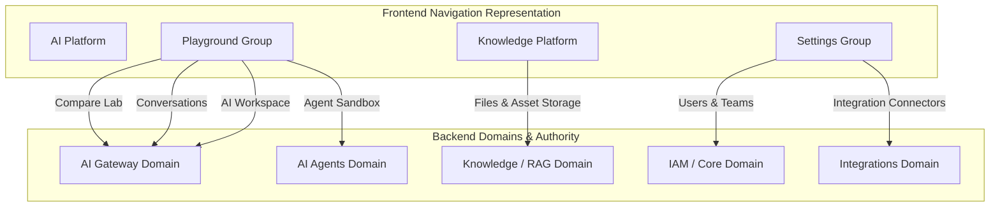

# EAIMOS Feature Ownership & Domain Boundary Specification

## Principle: Frontend Location ≠ Backend Domain Ownership

A core architectural principle of EAIMOS is that moving a user interface component under a consolidated or intuitive navigation group does **not** alter the underlying backend domain boundaries, database models, repositories, authentication, RBAC, or tenant isolation.

---

## 1. Domain Ownership Matrix

---

## 2. Component-by-Component Ownership Mapping

### 1. Compare Lab
* **Frontend Location**: `AI Platform` ➔ `Playground` ➔ `Compare Lab` (`/dashboard/playground/compare`)
* **Backend Domain**: **AI Gateway**
* **API Endpoints**: `/ai/completions/`, `/ai/models/`, `/ai/providers/`
* **Architecture**: The UI dispatches parallel prompt execution requests directly to the AI Gateway router, calculating throughput, TTFT, token usage, and cost side-by-side.

### 2. Agent Sandbox
* **Frontend Location**: `AI Platform` ➔ `Playground` ➔ `Agent Sandbox` (`/dashboard/playground/agent-sandbox`)
* **Backend Domain**: **AI Agents**
* **API Endpoints**: `/agents/`, `/agents/{id}/sessions/`, `/agents/sessions/{id}/runs/`, `/agents/runs/{id}/logs`
* **Architecture**: The UI executes multi-step agent runs via the AI Agents execution loop, preserving agent memory, tool calling, execution step logs, and telemetry.

### 3. AI Workspace
* **Frontend Location**: `AI Platform` ➔ `Playground` ➔ `AI Workspace` (`/dashboard/playground/workspace`)
* **Backend Domain**: **AI Gateway (Unified Execution)**
* **API Endpoints**: `/ai/models/`, `/ai/providers/`, `/ai/completions/`, `/ai/conversations/`
* **Architecture**: Serves as the central execution scratchpad for multi-turn prompt engineering, streaming completions, and dual model/agent interaction without duplicating backend services.

### 4. Conversations
* **Frontend Location**: `AI Platform` ➔ `Playground` ➔ `Conversations` (`/dashboard/playground/conversations`)
* **Backend Domain**: **AI Gateway / Chat Engine**
* **API Endpoints**: `/ai/conversations/`, `/ai/conversations/{id}/messages`
* **Architecture**: Preserves complete conversation history, streaming, model/provider usage metrics, cost attribution, and per-tenant/per-user isolation.

### 5. Files
* **Frontend Location**: `Knowledge Platform` ➔ `Files` (`/dashboard/knowledge/files`)
* **Backend Domain**: **Knowledge Platform**
* **API Endpoints**: `/files/`, `/knowledge/documents/`, `/knowledge/embeddings/`
* **Architecture**: Files remain strictly part of the Knowledge & RAG subsystem, providing media/document storage, chunking, indexing, and vectorization consumed by AI Gateway pipelines.

### 6. Users & Teams
* **Frontend Location**: `Settings` ➔ `Users & Teams` (`/dashboard/settings/users`)
* **Backend Domain**: **IAM / Core Platform**
* **API Endpoints**: `/users/`, `/organizations/{org_id}/members/`, `/auth/register`
* **Architecture**: Manages tenant membership, role assignment (Super Admin, Admin, Member, Viewer), and invite workflows with strict RBAC enforcement.

### 7. Integrations
* **Frontend Location**: `Settings` ➔ `Integrations` (`/dashboard/settings/integrations`)
* **Backend Domain**: **Integrations Domain**
* **API Endpoints**: `/integrations/`, `/webhooks/inbound/{org_id}`
* **Architecture**: Manages third-party connectors (Slack, SendGrid, Postgres, Stripe, Zapier) and webhook ingress with credential security and audit logging.

---

## 3. Authorization & Tenant Isolation Verification

All API calls continue to pass through standard authorization middleware:
1. `Authorization: Bearer <token>` required for all protected endpoints.
2. Tenant ID (`organization_id`) scoping enforced on database queries.
3. RBAC roles strictly verified at the API service layer.
