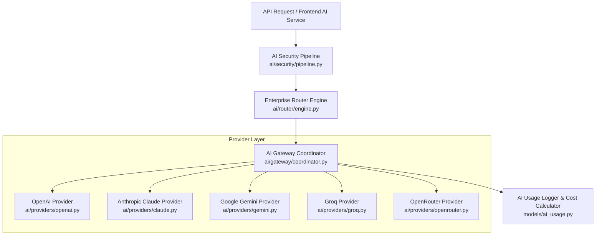
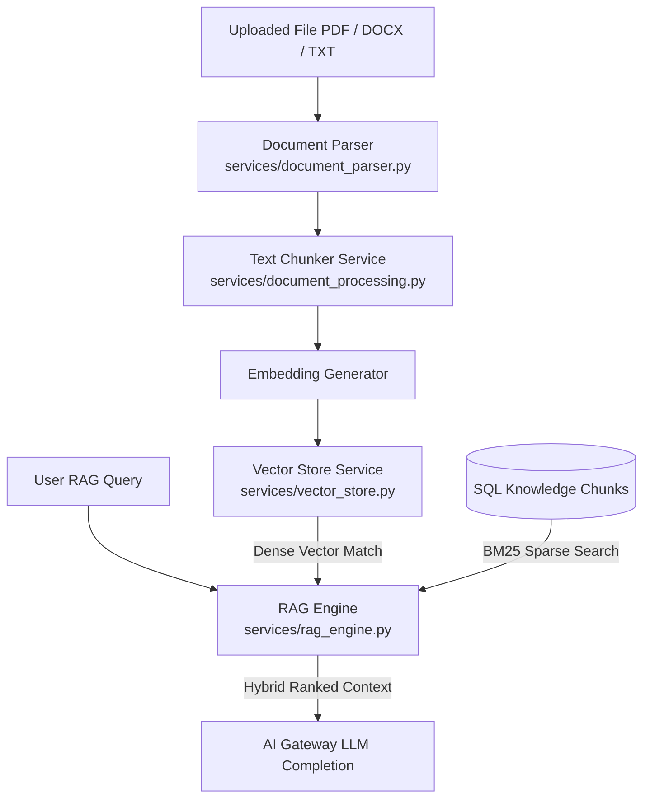

# AI Platform Architecture & Gateway 2.0

## Overview

The **AI Platform** in **MarkAI** provides a multi-provider LLM gateway, an enterprise routing engine, a prompt management platform, RAG knowledge retrieval, security scanning, and autonomous agent tools.

---

## AI Gateway 2.0 & Multi-Provider Architecture

The core of the AI Platform is the `AIGatewayCoordinator` ([coordinator.py](file:///d:/markai/apps/api/src/api/ai/gateway/coordinator.py)), which provides a single interface for executing completions across 5 external provider integrations.

### Supported Providers:
1. **OpenAI Provider** ([openai.py](file:///d:/markai/apps/api/src/api/ai/providers/openai.py)): Supports `gpt-4o`, `gpt-4-turbo`, `gpt-3.5-turbo`. Handles SSE token streaming and tool calling.
2. **Anthropic Claude Provider** ([claude.py](file:///d:/markai/apps/api/src/api/ai/providers/claude.py)): Supports `claude-3-5-sonnet-20240620`, `claude-3-opus-20240229`, `claude-3-haiku-20240307`. Translates OpenAI parameter formats into Anthropic Messages API formats.
3. **Google Gemini Provider** ([gemini.py](file:///d:/markai/apps/api/src/api/ai/providers/gemini.py)): Supports `gemini-1.5-pro`, `gemini-1.5-flash`. Supports REST-based generation and streaming.
4. **Groq Cloud Provider** ([groq.py](file:///d:/markai/apps/api/src/api/ai/providers/groq.py)): Accelerates open-weights models (`llama-3-70b-8832`, `mixtral-8x7b-32768`).
5. **OpenRouter Provider** ([openrouter.py](file:///d:/markai/apps/api/src/api/ai/providers/openrouter.py)): Serves as a universal proxy fallback for open models and specialized providers.

---

## Intelligent LLM Enterprise Router Engine

The router engine ([engine.py](file:///d:/markai/apps/api/src/api/ai/router/engine.py)) selects the target model dynamically based on specified policy constraints:

- **Cost Minimization Strategy**: Resolves to the lowest cost per 1K token model that satisfies minimal context window requirements.
- **Latency Minimization Strategy**: Directs requests to fast-inference providers (e.g. Groq Llama-3 or Gemini 1.5 Flash).
- **Capability Score Strategy**: Directs complex reasoning tasks to high-tier models (`gpt-4o` or `claude-3-5-sonnet`).
- **Fallback Cascades**: Automatically retries next-in-line providers if the primary provider experiences timeout or rate limit errors.

---

## Security Pipeline & Threat Scanner

Before any prompt is sent to an external LLM provider, it passes through the `AISecurityPipeline` ([pipeline.py](file:///d:/markai/apps/api/src/api/ai/security/pipeline.py)):

1. **Prompt Injection Guard**: Detects jailbreak attempts, system instruction overrides, and delimiters.
2. **PII Masking**: Scans input for social security numbers, credit card numbers, email addresses, and API keys.
3. **Toxicity & Harm Filter**: Scans prompt against forbidden categories.
4. **Post-Generation Output Guard**: Verifies completion text does not leak sensitive internal credentials or system prompts.

---

## Prompt Platform & Variable Interpolation

The Prompt Platform ([prompt.py](file:///d:/markai/apps/api/src/api/services/prompt.py)) manages enterprise prompts:

- **Version Control**: Every update creates a numbered `PromptVersion` record linked to the parent `Prompt`.
- **Variable Interpolation**: Templated syntax (e.g., `{{company_name}}`, `{{target_audience}}`) is dynamically replaced during execution.
- **Execution Tracking**: Logged in `prompt_executions` with execution duration, model used, and output tokens.

---

## Knowledge Base & RAG Architecture

- **Document Ingestion** ([document_parser.py](file:///d:/markai/apps/api/src/api/services/document_parser.py)): Extracts plain text from PDFs, Microsoft Word (`.docx`), plain text files, and CSV spreadsheets.
- **Vector Store** ([vector_store.py](file:///d:/markai/apps/api/src/api/services/vector_store.py)): Manages vector embedding creation and retrieval with fallback memory indexing.
- **Hybrid RAG Search** ([rag_engine.py](file:///d:/markai/apps/api/src/api/services/rag_engine.py)): Combines dense semantic vector search with sparse keyword search to generate high-relevance context windows for LLM completions.
