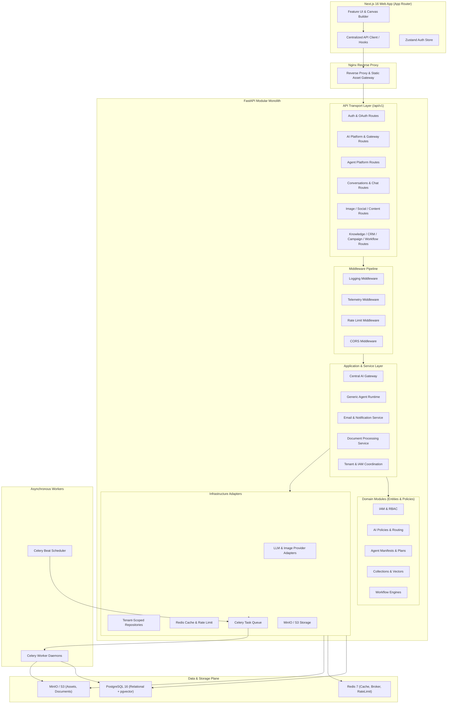
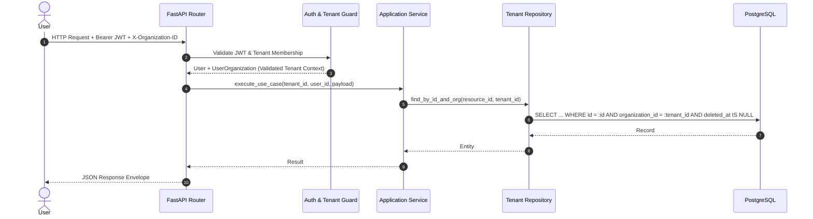
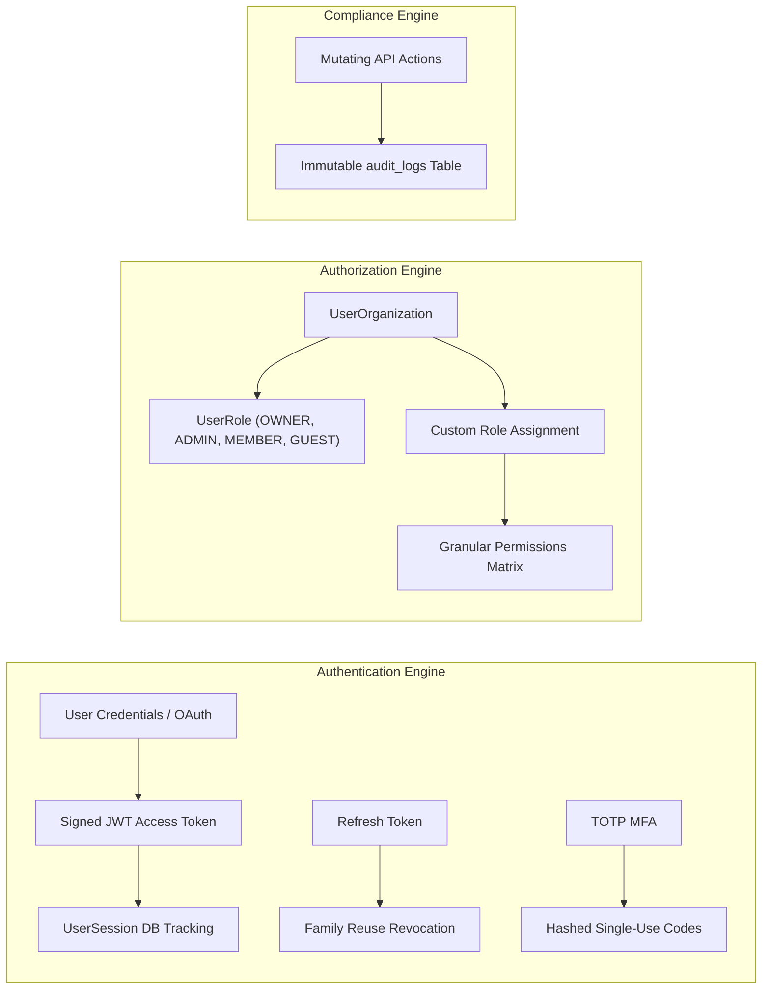
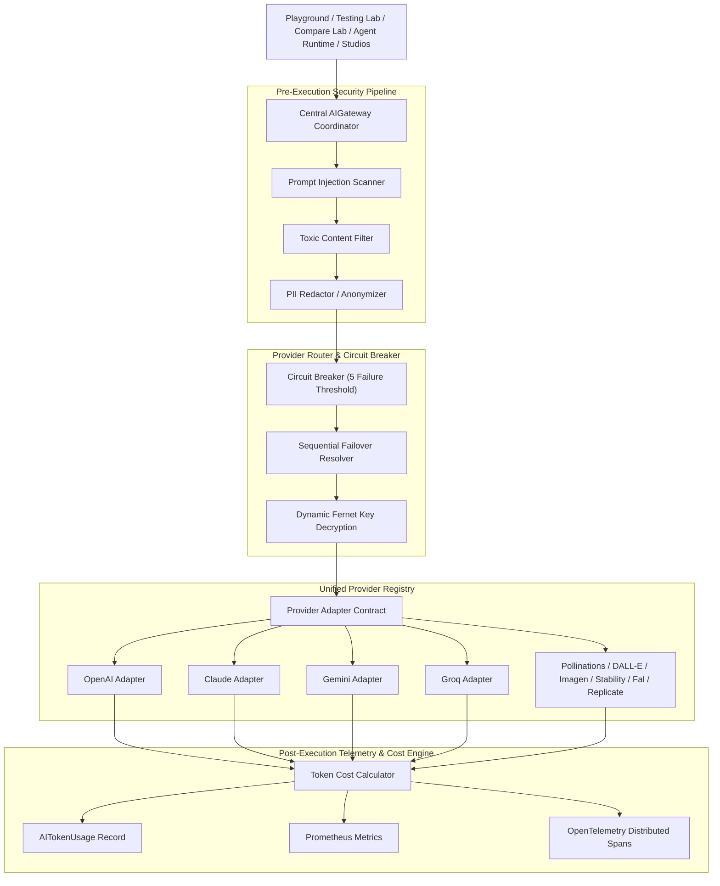
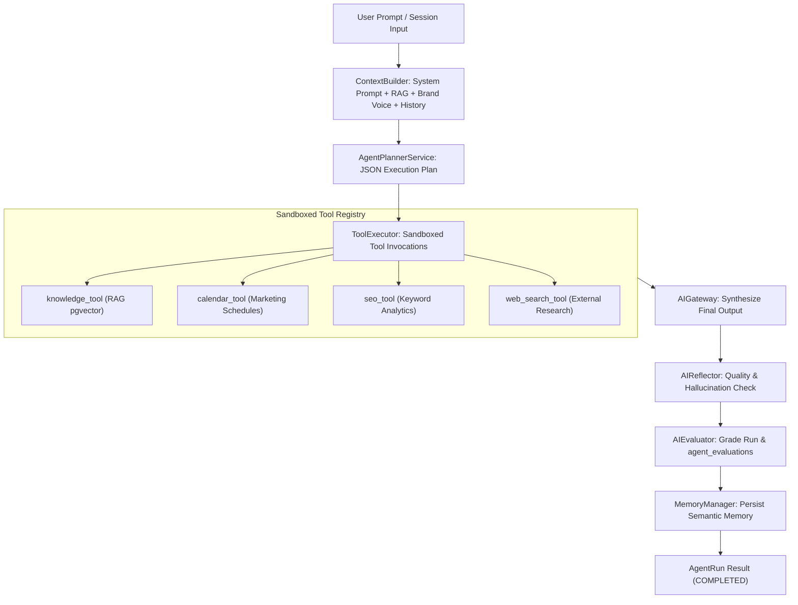
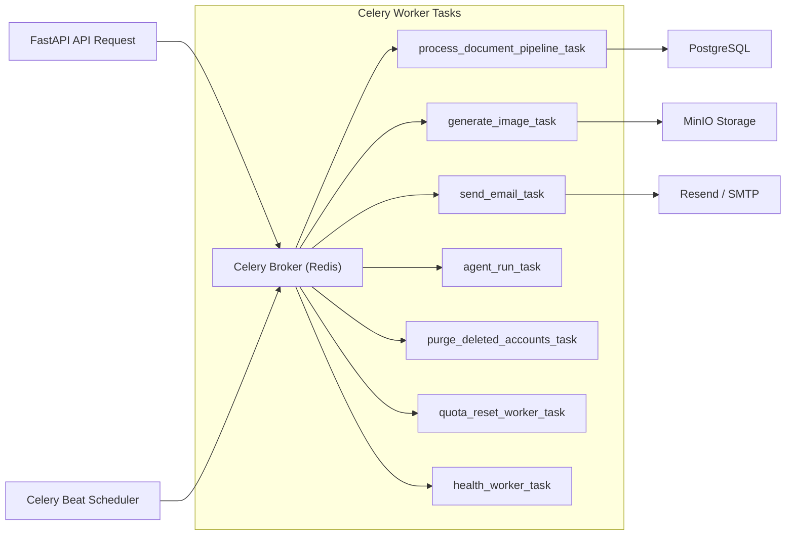

# EAIMOS Architecture Specification (Frozen Target)

**Document Version**: 1.0.0 — Architecture Freeze  
**Status**: FROZEN  
**Target System**: Enterprise AI Marketing Operating System (EAIMOS / MarkAI)  
**Base Architecture**: Modular Monolith with Domain-Oriented Hexagonal Boundaries  

---

## 1. Architectural Style & Principles

EAIMOS is structured as a **Modular Monolith** organized into distinct, domain-oriented modules with strict hexagonal (ports & adapters) layer boundaries.



### Core Architecture Invariants:
1. **Single Modular Monolith**: No distributed microservices. All capabilities reside in a single codebase with clean in-process domain boundaries.
2. **Strict Layer Dependency Direction**: Dependencies flow inward from Transport (`routes`) to Application (`services`) to Domain (`models/policies`) to Infrastructure (`repositories/adapters`). No lower layer may import a higher layer.
3. **Single AI Execution Plane**: All AI inferences (Playground, Testing Lab, Compare Lab, Agents, Studios, Chat) must execute through the centralized `AIGateway` and unified provider router. No module may invoke AI providers directly.
4. **Generic Agent Runtime**: `AgentRuntime` coordinates context, planning, tool execution, gateway synthesis, reflection, and evaluation generically. Agent specializations belong in manifests, prompts, and tools—not hardcoded runtime conditionals.
5. **Server-Side Tenant Isolation Invariant**: Multi-tenancy is enforced at the repository and service layers. Every organization-scoped resource requires explicit `organization_id` validation.

---

## 2. Backend Layered Architecture

The backend follows Clean/Hexagonal layered architecture:

```
┌──────────────────────────────────────────────────────────┐
│                      API Transport                       │
│  FastAPI Routers, Request/Response DTOs, Auth Guards     │
└────────────────────────────┬─────────────────────────────┘
                             │
                             ▼
┌──────────────────────────────────────────────────────────┐
│                   Application Services                   │
│  Use Case Orchestration, Workflows, Gateway Coordination │
└────────────────────────────┬─────────────────────────────┘
                             │
                             ▼
┌──────────────────────────────────────────────────────────┐
│                      Domain Layer                        │
│  Entities, Aggregates, Value Objects, Domain Policies    │
└────────────────────────────┬─────────────────────────────┘
                             │
                             ▼
┌──────────────────────────────────────────────────────────┐
│                   Repositories & Ports                   │
│  Tenant-Scoped Data Access Interfaces, Abstractions      │
└────────────────────────────┬─────────────────────────────┘
                             │
                             ▼
┌──────────────────────────────────────────────────────────┐
│                  Infrastructure Layer                    │
│  SQLAlchemy ORM, Postgres/pgvector, Redis, MinIO, Celery │
└──────────────────────────────────────────────────────────┘
```

### Layer Responsibilities:

| Layer | Directory Location | Permitted Responsibilities | Prohibited Actions |
|---|---|---|---|
| **API Transport** | `apps/api/src/api/routes/` | HTTP request routing, input validation via Pydantic schemas, dependency injection (`Depends`), HTTP status codes, SSE streaming response envelopes. | No direct business calculations, no direct external API calls, no bypassing services. |
| **Application Services** | `apps/api/src/api/services/`, `apps/api/src/api/ai/` | Orchestrating use cases, invoking repositories, managing transactional units, dispatching background tasks, coordinating AI gateway. | No direct HTTP request parsing, no raw SQL string execution. |
| **Domain Layer** | `apps/api/src/api/models/` | SQLAlchemy entity definitions, table relationships, domain enums, status transitions, schema constraints. | No dependency on routes or external HTTP clients. |
| **Repositories / Ports** | `apps/api/src/api/repositories/` | Tenant-scoped data persistence operations, query filtering, pagination helpers, soft-delete filtering. | No global unbound database queries without tenant isolation. |
| **Infrastructure** | `apps/api/src/api/ai/providers/`, `api/worker/`, `api/database/` | Postgres connection management, pgvector operations, Redis caching, Celery task definitions, MinIO/S3 SDK integration, external provider REST adapters. | No coupling to transport-specific schemas. |

---

## 3. Shared Core & Cross-Cutting Infrastructure

The shared core (`apps/api/src/api/core/`) is kept minimal and strictly cross-cutting:

- **Configuration** (`api.core.config`): Pydantic Settings resolving environment variables (`DATABASE_URL`, `REDIS_URL`, `SECRET_KEY`, `ENCRYPTION_KEY`, `MINIO_ENDPOINT`, `CORS_ORIGINS`).
- **Security Primitives** (`api.core.security`): Cryptographic JWT encode/decode, bcrypt password hashing, Fernet provider credential encryption.
- **Dependencies & Context** (`api.core.deps`): `get_db`, `get_current_user`, `get_tenant_context`, `RoleChecker`.
- **Telemetry & Tracing** (`api.core.telemetry`): OpenTelemetry tracer initializers and distributed trace span context managers.
- **Database Session** (`api.database.session`): Engine connection pooling (`pool_size=50`, `max_overflow=100`, `pool_pre_ping=True`).

---

## 4. Multi-Tenant Architecture & Data Isolation

Multi-tenancy in EAIMOS is a platform-level invariant enforced server-side.



### Invariants:
1. Every organization-owned entity possesses a non-nullable `organization_id: UUID` foreign key pointing to `organizations.id`.
2. Every database read, update, and delete query must include `organization_id == active_tenant_id`.
3. Switching organizations requires a valid `UserOrganization` membership record in the target organization.
4. Quotas and token usage limits (`AIOrgLimit`) are scoped to the active tenant.

---

## 5. Central IAM & Authorization Architecture

### Triad Model:
- **Authentication** (*Who are you?*): Validated via JWT access tokens and database session tracking.
- **Authorization** (*What can you do?*): Verified via `RoleChecker` evaluating `UserRole` and granular `Permission` records.
- **Tenant Context** (*Where are you operating?*): Resolved via `UserOrganization` linking `user_id` and `organization_id`.



---

## 6. AI Platform Architecture

The centralized AI Platform executes all model interactions across text, image, audio, video, vision, embeddings, and multimodal capabilities.



---

## 7. Generic Agent Platform Architecture

The Agent Platform decouples agent logic from specific domains, executing all agent tasks through a uniform lifecycle.



---

## 8. Data & Storage Architecture

### PostgreSQL 16 & pgvector:
- Primary transactional store for all relational entities.
- Semantic vector embeddings stored in `knowledge_document_chunks.embedding` using `vector(1536)` with cosine distance (`<=>`) HNSW/IVFFlat indexing.

### Redis 7:
- Session cache and fast quota usage counters.
- Token-bucket rate limiting backend (`RateLimitMiddleware`).
- Message broker and result backend for Celery background tasks.

### MinIO / S3:
- Object storage bucket `eaimos-storage` for generated images, uploaded documents, knowledge PDFs, and CSV exports.

---

## 9. Asynchronous Processing Architecture



---

## 10. Frontend Architecture (Next.js 16)

The frontend adopts a **Feature-Based Architecture**:

```
apps/web/src/
├── app/                         # Next.js App Router pages & layouts
│   ├── (marketing)/             # Public marketing & documentation pages
│   ├── auth/                    # Authentication flows
│   └── dashboard/               # Protected workspace dashboard
├── features/                    # Feature modules (Components, Hooks, Store, API)
│   ├── ai-platform/             # Observability, Playground, Compare, Models, Router
│   ├── agents/                  # Agent builder, marketplace, runs, playground
│   ├── image-studio/            # Image canvas, generation, inpainting, history
│   ├── social/                  # Multi-platform post creator, scheduler, calendar
│   ├── content-studio/          # Long-form article & copywriting studio
│   ├── knowledge/               # Knowledge base, collections, document parser
│   ├── campaigns/               # Marketing campaigns & broadcast builder
│   ├── crm/                     # Contacts, segments, lead management
│   ├── prompts/                 # Prompt library, template editor, testing lab
│   └── workflows/               # Drag-and-drop automation flow builder
├── components/ui/               # Reusable atomic UI components
├── services/                    # Centralized Axios API client (api-client.ts)
├── store/                       # Global Zustand stores (auth.ts, theme.ts)
└── platform/                    # Cross-cutting error sanitizers and utilities
```

---

## 11. Security, Observability & Quality Gates

1. **Error Sanitization Contract**:
   - Backend returns structured error JSON: `{"detail": "Machine readable message", "code": "ERROR_CODE"}`.
   - Frontend passes errors through `getSafeErrorMessage()` to prevent leakage of stack traces, SQL errors, or file paths.
2. **Telemetry & Observability**:
   - OpenTelemetry spans wrapping all HTTP requests and Celery tasks.
   - Prometheus metrics exposed on `/metrics`.
   - `AlertEngine` automatically reporting system incidents upon background job failures.
3. **Quality Gates**:
   - Every commit must pass architecture fitness rules, type checks, lint checks, unit tests, and migration validation.
