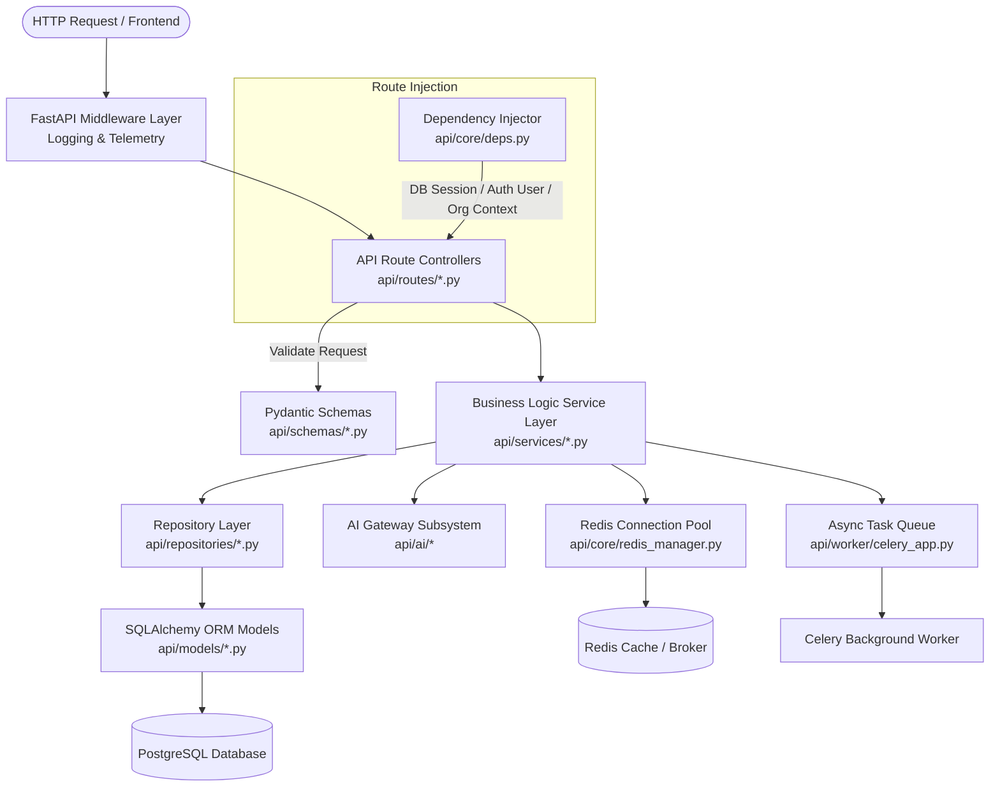

# Backend Architecture Documentation

## Architectural Overview

The backend of **MarkAI** is built as an asynchronous RESTful service using [FastAPI](https://fastapi.tiangolo.com/) (Python 3.11+). It follows a **clean, layered architecture** separated into clear operational layers: Presentation (Routes & Controllers), Business Logic (Services), Data Access (Repositories & Models), Infrastructure (Core Utilities, Cache & Telemetry), and Asynchronous Work (Celery Workers).

---

## Directory Structure

```
apps/api/src/api/
├── main.py                     # FastAPI application setup, router mounting, startup seeding
├── core/                       # Core system configuration & foundational services
│   ├── config.py               # Environment & settings configuration (Pydantic BaseSettings)
│   ├── deps.py                 # Dependency injection (DB sessions, auth, RBAC, organization context)
│   ├── encryption.py           # Encryption utilities (Fernet for API keys & secrets)
│   ├── logging.py              # Structured logging configuration
│   ├── metrics.py              # Base metrics helpers
│   ├── metrics_registry.py     # Prometheus metrics registry
│   ├── redis_manager.py        # Async Redis connection pool manager
│   ├── security.py             # JWT token creation & password hashing (Bcrypt)
│   └── telemetry.py            # OpenTelemetry tracer initialization
├── database/                   # Database connection & session factory
│   └── session.py              # SQLAlchemy engine & SessionLocal factory
├── middleware/                 # Custom FastAPI HTTP middleware
│   ├── logging.py              # HTTP Request/Response logging middleware
│   └── telemetry_middleware.py # OpenTelemetry HTTP request tracing middleware
├── models/                     # SQLAlchemy ORM database models (32 model files)
│   ├── agent.py, ai_platform.py, auth.py, campaign.py, conversation.py,
│   ├── knowledge.py, lead.py, memory.py, prompt.py, workflow.py, ...
├── repositories/               # Data access abstraction layer
│   ├── base.py                 # Generic CRUD Repository base class
│   ├── agent.py, campaign.py, conversation.py
├── routes/                     # FastAPI Route API Controllers (21 route modules)
│   ├── agents.py, ai.py, analytics.py, auth.py, campaigns.py, chat.py, crm.py,
│   ├── files.py, generator.py, infrastructure.py, integrations.py, knowledge.py, ...
├── schemas/                    # Pydantic request/response validation schemas (17 schema modules)
│   ├── agent.py, ai.py, campaign.py, chat.py, common.py, crm.py, knowledge.py, ...
├── services/                   # Core business logic layer (19 service modules)
│   ├── agent_executor.py, agent_planner.py, alert_engine.py, analytics_service.py,
│   ├── document_parser.py, knowledge.py, prompt.py, rag_engine.py, vector_store.py, ...
├── ai/                         # Enterprise AI Gateway 2.0 Subsystem
│   ├── gateway/coordinator.py  # Multi-provider SSE streaming proxy engine
│   ├── providers/              # Provider implementations (OpenAI, Claude, Gemini, Groq, OpenRouter)
│   ├── registry/manager.py     # AI model & provider registry manager
│   ├── router/engine.py        # Intelligent routing engine (Cost, Latency, Capability)
│   ├── security/pipeline.py    # Pre/Post execution AI security & threat scanner
│   └── tools/                  # Agent tool definitions (CRM, Knowledge, Search, Workflow)
└── worker/
    └── celery_app.py           # Celery background worker setup & async task definitions
```

---

## Layered Architecture & Dependency Flow



---

## HTTP Request Lifecycle

1. **Ingress & Middleware Execution**:
   - Request enters through [main.py](file:///d:/markai/apps/api/src/api/main.py).
   - `LoggingMiddleware` captures incoming path, HTTP method, client IP, and assigns a request ID.
   - `TelemetryMiddleware` creates an OpenTelemetry span for tracing.
2. **Authentication & Multi-Tenant Dependency Resolution**:
   - Routes declare dependencies via `FastAPI.Depends(get_current_user)` or `Depends(get_current_org)` defined in [deps.py](file:///d:/markai/apps/api/src/api/core/deps.py).
   - `deps.py` verifies the HTTP `Authorization: Bearer <JWT>` token using [security.py](file:///d:/markai/apps/api/src/api/core/security.py).
   - Organization multi-tenancy is validated by querying `UserOrganization` membership.
3. **Request Validation**:
   - FastAPI parses and validates the request body using Pydantic schemas in `api/schemas/`.
4. **Service Execution**:
   - Route controller delegates execution to dedicated domain services in `api/services/`.
   - AI generation requests pass through `AISecurityPipeline` ([pipeline.py](file:///d:/markai/apps/api/src/api/ai/security/pipeline.py)) before calling `AIGatewayCoordinator` ([coordinator.py](file:///d:/markai/apps/api/src/api/ai/gateway/coordinator.py)).
5. **Data Access & Persistence**:
   - Services use generic and domain-specific repository classes (`BaseRepository`) in `api/repositories/` to query or update PostgreSQL database records.
6. **Egress & Response Formatting**:
   - Standard responses return validated Pydantic DTOs.
   - Streaming AI endpoints return SSE `EventSourceResponse` frames.
   - Unhandled exceptions are converted into standardized JSON errors by `global_exception_handler` in [main.py](file:///d:/markai/apps/api/src/api/main.py#L175-L191).

---

## Core Utilities & Helpers

- **Encryption** (`api.core.encryption`): Cryptographic Fernet utility used to encrypt and decrypt sensitive third-party API keys stored in the database.
- **Security** (`api.core.security`): Passlib Bcrypt wrapper for hashing user passwords and PyJWT encoder/decoder for handling access and refresh tokens.
- **Redis Manager** (`api.core.redis_manager`): Connection manager managing async Redis connections for rate limiting, cache retrieval, and prompt response caching.
- **Telemetry & Metrics** (`api.core.telemetry`, `api.core.metrics_registry`): System metrics tracking active requests, token generation totals, AI provider latencies, and OpenTelemetry HTTP traces.
