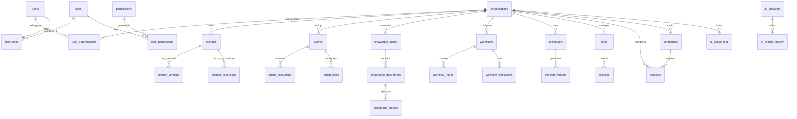

# Database Architecture & ER Diagrams

## Architectural Overview

**MarkAI** uses a relational database architecture managed via **SQLAlchemy 2.0 ORM** and schema migrations executed by **Alembic**. The default database engine is **PostgreSQL**, with SQLite supported for local testing environments (`_temp_test_db.db`).

---

## Entity Relationship (ER) Diagram

---

## Core Database Tables Reference

### 1. Security, Users & Multi-Tenancy

- **`users`** ([user.py](file:///d:/markai/apps/api/src/api/models/user.py)): Stores user identity records.
  - Columns: `id` (UUID/Int, PK), `email` (String, Unique, Indexed), `hashed_password` (String), `full_name` (String), `is_active` (Boolean), `created_at` (DateTime), `updated_at` (DateTime).
- **`organizations`** ([organization.py](file:///d:/markai/apps/api/src/api/models/organization.py)): Multi-tenant organization boundaries.
  - Columns: `id` (UUID/Int, PK), `name` (String), `slug` (String, Unique, Indexed), `created_at` (DateTime).
- **`user_organizations`** ([membership.py](file:///d:/markai/apps/api/src/api/models/membership.py)): Organization membership mapping.
  - Columns: `id` (PK), `user_id` (FK -> users.id), `organization_id` (FK -> organizations.id), `role` (Enum: `OWNER`, `ADMIN`, `MEMBER`, `GUEST`).
- **`roles` & `permissions`** ([auth.py](file:///d:/markai/apps/api/src/api/models/auth.py)): RBAC role definitions and fine-grained permissions (`manage_users`, `manage_billing`, `create_content`, `view_analytics`).

---

### 2. AI Infrastructure & Usage Logging

- **`ai_providers`** ([ai_platform.py](file:///d:/markai/apps/api/src/api/models/ai_platform.py)): Registered AI API providers (OpenAI, Claude, Gemini, Groq, OpenRouter).
  - Columns: `id` (PK), `name` (String), `provider_type` (String), `api_key_encrypted` (String), `is_active` (Boolean), `created_at` (DateTime).
- **`ai_model_registry`** ([ai_platform.py](file:///d:/markai/apps/api/src/api/models/ai_platform.py)): Catalogue of available LLM models.
  - Columns: `id` (PK), `provider_id` (FK -> ai_providers.id), `model_name` (String), `context_window` (Int), `cost_per_1k_input` (Float), `cost_per_1k_output` (Float), `is_healthy` (Boolean).
- **`ai_usage_logs`** ([ai_usage.py](file:///d:/markai/apps/api/src/api/models/ai_usage.py)): Token generation cost and audit logs.
  - Columns: `id` (PK), `organization_id` (FK -> organizations.id), `user_id` (FK -> users.id), `model_name` (String), `prompt_tokens` (Int), `completion_tokens` (Int), `estimated_cost` (Float), `created_at` (DateTime).

---

### 3. Knowledge Base & RAG Tables

- **`knowledge_bases`** ([knowledge.py](file:///d:/markai/apps/api/src/api/models/knowledge.py)): Organization knowledge repositories.
- **`knowledge_documents`**: Ingested files (PDF, DOCX, TXT).
- **`knowledge_chunks`**: Split text chunks with associated vector embeddings.
  - Columns: `id` (PK), `document_id` (FK -> knowledge_documents.id), `chunk_index` (Int), `content` (Text), `embedding` (Vector / JSON), `created_at` (DateTime).

---

### 4. Agents & Workflows

- **`agents`** ([agent.py](file:///d:/markai/apps/api/src/api/models/agent.py)): Agent definitions, system prompts, and tool configurations.
- **`agent_executions`**: Historical execution runs, steps, logs, and token usage.
- **`workflows`** ([workflow.py](file:///d:/markai/apps/api/src/api/models/workflow.py)): Node graph workflow definitions.
- **`workflow_nodes`**: Individual triggers, conditions, and action steps.
- **`workflow_executions`**: Workflow run status (`PENDING`, `RUNNING`, `COMPLETED`, `FAILED`).
