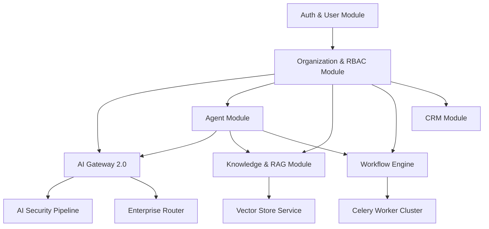
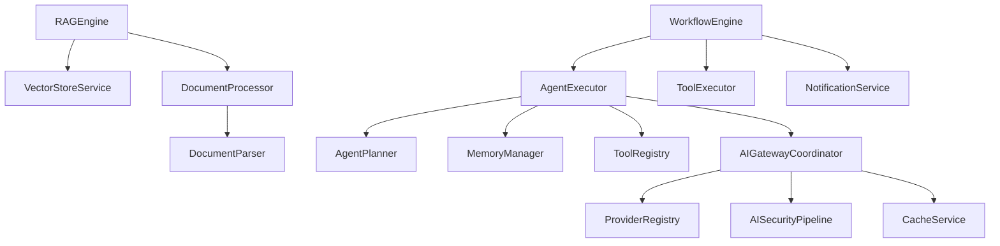
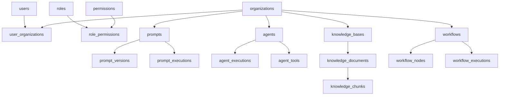

# System Dependency Graphs

## 1. Module Dependency Graph

```mermaid
graph TD
    AuthModule[Auth & User Module] --> OrgModule[Organization & RBAC Module]
    OrgModule --> AIGateway[AI Gateway 2.0]
    OrgModule --> AgentModule[Agent Module]
    OrgModule --> RAGModule[Knowledge & RAG Module]
    OrgModule --> WorkflowModule[Workflow Engine]
    OrgModule --> CRMModule[CRM Module]
    
    AIGateway --> SecurityModule[AI Security Pipeline]
    AIGateway --> RouterModule[Enterprise Router]
    
    AgentModule --> AIGateway
    AgentModule --> RAGModule
    AgentModule --> WorkflowModule
    
    RAGModule --> VectorStore[Vector Store Service]
    WorkflowModule --> CeleryWorker[Celery Worker Cluster]
```

---

## 2. Service Dependency Graph

```mermaid
graph TD
    AgentExecutor[AgentExecutor] --> AgentPlanner[AgentPlanner]
    AgentExecutor --> MemoryManager[MemoryManager]
    AgentExecutor --> ToolRegistry[ToolRegistry]
    AgentExecutor --> AIGatewayCoordinator[AIGatewayCoordinator]

    RAGEngine[RAGEngine] --> VectorStoreService[VectorStoreService]
    RAGEngine --> DocumentProcessor[DocumentProcessor]
    DocumentProcessor --> DocumentParser[DocumentParser]

    WorkflowEngine[WorkflowEngine] --> AgentExecutor
    WorkflowEngine --> ToolExecutor[ToolExecutor]
    WorkflowEngine --> NotificationService[NotificationService]

    AIGatewayCoordinator --> ProviderRegistry[ProviderRegistry]
    AIGatewayCoordinator --> SecurityPipeline[AISecurityPipeline]
    AIGatewayCoordinator --> CacheService[CacheService]
```

---

## 3. Database Table Dependencies

```mermaid
graph TD
    users --> user_organizations
    organizations --> user_organizations
    roles --> role_permissions
    permissions --> role_permissions
    
    organizations --> prompts
    prompts --> prompt_versions
    prompts --> prompt_executions
    
    organizations --> agents
    agents --> agent_executions
    agents --> agent_tools

    organizations --> knowledge_bases
    knowledge_bases --> knowledge_documents
    knowledge_documents --> knowledge_chunks

    organizations --> workflows
    workflows --> workflow_nodes
    workflows --> workflow_executions
```
