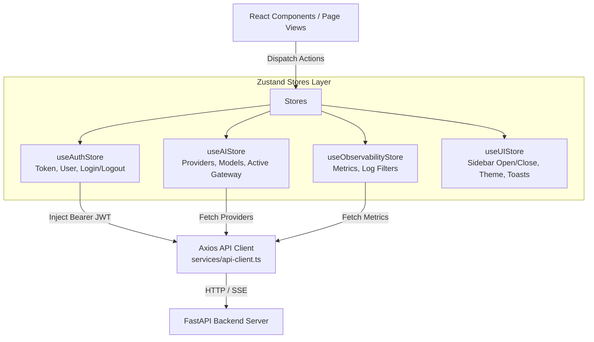

# Frontend Architecture Documentation

## Overview

The frontend of **MarkAI** is built using **Next.js 15** (App Router architecture) with **React 19** and **TypeScript**. Styling is powered by **TailwindCSS 3.x** and icons are provided by **Lucide React**. Client-side state management is handled through modular [Zustand](https://zustand-demo.pmnd.rs/) stores.

---

## Directory Structure

```
apps/web/src/
├── app/                        # Next.js App Router root
│   ├── (marketing)/            # Public landing & marketing layout group
│   ├── auth/                   # Authentication routes
│   │   ├── login/page.tsx      # User login page
│   │   └── register/page.tsx   # User registration page
│   ├── dashboard/              # Protected Enterprise Dashboard routes
│   │   ├── page.tsx            # Main Analytics & KPI Overview dashboard
│   │   ├── agents/page.tsx     # AI Agent builder & execution view
│   │   ├── ai/page.tsx         # AI Gateway, provider registry & routing view
│   │   ├── analytics/page.tsx  # System observability & latency metrics
│   │   ├── campaigns/page.tsx  # Marketing campaign management
│   │   ├── conversations/      # AI chat & conversation history
│   │   ├── crm/page.tsx        # CRM leads, contacts & company management
│   │   ├── files/page.tsx      # File asset manager
│   │   ├── generator/page.tsx  # Multi-channel content generator
│   │   ├── integrations/       # Third-party integration hub
│   │   ├── knowledge/page.tsx  # Document ingestion & RAG knowledge base
│   │   ├── prompts/page.tsx    # Prompt template registry & playground
│   │   ├── settings/page.tsx   # Organization settings, security & RBAC
│   │   ├── users/page.tsx      # Team members & permissions management
│   │   └── workflows/page.tsx  # Graph workflow automation builder
│   ├── error.tsx               # Global error boundary component
│   ├── globals.css             # Tailwind design tokens & base CSS styling
│   ├── layout.tsx              # Root HTML layout with providers wrapper
│   └── page.tsx                # Application root entry (redirects to dashboard/auth)
├── components/                 # Reusable UI component library
│   ├── landing/                # Public marketing landing components
│   └── ui/                     # Shared UI primitives (Buttons, Inputs, Cards, Dialogs, Badges)
├── features/                   # Feature-specific complex component modules
│   ├── agents/                 # Agent config forms, execution logs & tool selectors
│   ├── ai-platform/            # Model registry lists & latency graphs
│   ├── knowledge/              # File upload dropzones & chunk previews
│   ├── prompts/                # Prompt editor & playground tester
│   └── workflows/              # Workflow node graph editor components
├── layouts/                    # Layout wrappers (Sidebar, Top Navigation Bar, Header)
├── providers/                  # React Context providers (Query, Toast, Auth wrappers)
├── services/                   # Client-side HTTP API communication
│   └── api-client.ts           # Axios client with JWT interceptor & refresh logic
└── store/                      # Zustand state management stores
    ├── ai.ts                   # AI Gateway state (Selected model, providers list, prompt)
    ├── auth.ts                 # Authentication state (Tokens, user profile, login/logout)
    ├── observability.ts        # Observability state (Metrics data, error log filters)
    └── ui.ts                   # Application UI state (Sidebar toggle, active theme, toasts)
```

---

## State Management Architecture (Zustand)



### Zustand Stores Detail:

1. **`useAuthStore`** ([auth.ts](file:///d:/markai/apps/web/src/store/auth.ts)):
   - State: `user`, `token`, `isAuthenticated`, `isLoading`.
   - Actions: `setAuth(user, token)`, `logout()`, `updateUser(data)`.
   - Persistence: LocalStorage token persistence for seamless refresh on reload.

2. **`useAIStore`** ([ai.ts](file:///d:/markai/apps/web/src/store/ai.ts)):
   - State: `providers`, `models`, `selectedModel`, `isStreaming`.
   - Actions: `setProviders(list)`, `setModels(list)`, `selectModel(modelId)`.

3. **`useObservabilityStore`** ([observability.ts](file:///d:/markai/apps/web/src/store/observability.ts)):
   - State: `metrics`, `logs`, `refreshInterval`.
   - Actions: `setMetrics(data)`, `setLogs(list)`.

4. **`useUIStore`** ([ui.ts](file:///d:/markai/apps/web/src/store/ui.ts)):
   - State: `sidebarOpen`, `theme`, `toasts`.
   - Actions: `toggleSidebar()`, `addToast(toast)`, `removeToast(id)`.

---

## Data Fetching & HTTP Client

All client-side API requests pass through the centralized Axios HTTP client defined in [api-client.ts](file:///d:/markai/apps/web/src/services/api-client.ts).

### Key Features:
- **Automatic Auth Injection**: Reads JWT access token from `useAuthStore` and appends `Authorization: Bearer <JWT>` header.
- **Token Rotation**: Listens for HTTP 401 Unauthorized responses and attempts automatic refresh via `/api/v1/auth/refresh`.
- **Standardized Response Extraction**: Formats backend JSON envelopes (`{ success: true, data: ... }`) into predictable Promise responses.

---

## Page Routes Summary

| Route Path | View Component | Protected | Description |
| :--- | :--- | :--- | :--- |
| `/auth/login` | `auth/login/page.tsx` | No | User login with email/password |
| `/auth/register` | `auth/register/page.tsx` | No | User registration & tenant setup |
| `/dashboard` | `dashboard/page.tsx` | Yes | Enterprise KPI overview & analytics |
| `/dashboard/agents` | `dashboard/agents/page.tsx` | Yes | Agent builder & execution management |
| `/dashboard/ai` | `dashboard/ai/page.tsx` | Yes | AI Gateway, Providers & Model Registry |
| `/dashboard/analytics` | `dashboard/analytics/page.tsx` | Yes | Latency graphs, Prometheus metrics & logs |
| `/dashboard/campaigns` | `dashboard/campaigns/page.tsx` | Yes | Marketing campaign flow management |
| `/dashboard/conversations` | `dashboard/conversations/page.tsx` | Yes | Multi-model chat & message history |
| `/dashboard/crm` | `dashboard/crm/page.tsx` | Yes | Lead management, contacts & activity logs |
| `/dashboard/files` | `dashboard/files/page.tsx` | Yes | File uploads & asset management |
| `/dashboard/generator` | `dashboard/generator/page.tsx` | Yes | Multi-channel AI content generator |
| `/dashboard/integrations` | `dashboard/integrations/page.tsx` | Yes | Slack, HubSpot, Salesforce integration hub |
| `/dashboard/knowledge` | `dashboard/knowledge/page.tsx` | Yes | RAG Knowledge bases & document ingestion |
| `/dashboard/prompts` | `dashboard/prompts/page.tsx` | Yes | Prompt library & testing playground |
| `/dashboard/settings` | `dashboard/settings/page.tsx` | Yes | Organization members, roles & security controls |
| `/dashboard/workflows` | `dashboard/workflows/page.tsx` | Yes | Node-based workflow automation editor |
