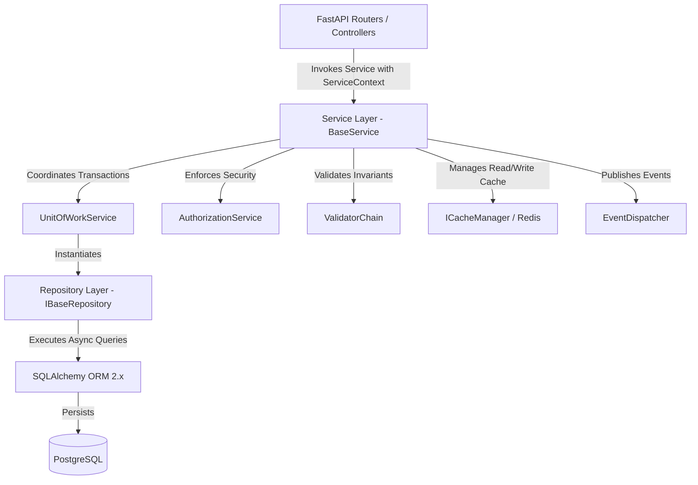
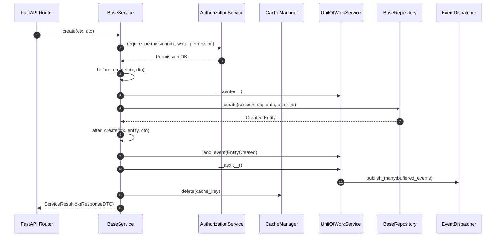

# EAIMOS Service Layer Architecture & Extension Guide

## Executive Summary

The EAIMOS Service Layer is the central orchestration and business logic boundary of the Enterprise AI Marketing Operating System. Sitting strictly between presentation layers (FastAPI routers, background workers) and data persistence (Repository Layer), the Service Layer encapsulates all business rules, validation, multi-tenant authorization, transactional boundaries, caching, and domain event dispatching.

---

## Clean Architecture Principles



### Key Architectural Constraints
1. **Framework Independence**: Services DO NOT import FastAPI or HTTP request/response classes (`Request`, `Response`, `HTTPException`).
2. **Repository Boundary**: Services NEVER execute direct SQLAlchemy queries or touch ORM sessions directly; all data operations route through `IBaseRepository` and `UnitOfWork`.
3. **Multi-Tenant Scoping**: Service operations require a `ServiceContext` specifying tenant organization ID, automatically isolating data.
4. **Transactional Integrity**: Data mutations take place within an explicit `UnitOfWorkService` context.
5. **Event-Driven Decoupling**: Domain events are buffered during transaction execution and dispatched via `EventDispatcher` only after database commit succeeds.

---

## Core Components Architecture

### 1. `ServiceContext`
An immutable execution context containing request identity and security parameters:
- `user_id`: ID of the acting user or system principal.
- `organization_id`: Multi-tenant organization boundary.
- `roles`: Assigned RBAC roles (e.g., `organization_admin`, `marketer`, `developer`).
- `permissions`: Assigned granular permission set (`iam:user:read`, `ai:request:create`, etc.).
- `correlation_id` & `trace_id`: Distributed tracing headers.
- `feature_flags`: Feature toggles evaluated for the current tenant.

### 2. `ServiceResult[T]`
A standard generic container returned by all service operations:
- `success`: Boolean indicator.
- `data`: Typed domain payload `T`.
- `errors`: List of error messages.
- `warnings`: Operational warning messages.
- `metadata`: Execution timing, pagination info, cache hit status.
- `error_code`: Machine-readable error code.
- `status_code`: Semantic HTTP-compatible status code (400, 401, 403, 404, 409, 422, 500).

### 3. `UnitOfWorkService` & `@transactional`
Wraps database transaction boundaries while managing an event buffer.
- `__aenter__`: Opens database transaction and initializes event buffer.
- `__aexit__`: Rolls back transaction and clears event buffer on exception; commits database transaction and dispatches buffered events on success.

### 4. `AuthorizationService`
Enforces multi-tenant isolation, RBAC role matrices, fine-grained permissions, resource ownership, and feature flags.

### 5. `EventDispatcher` & Domain Events
Asynchronous in-memory event bus with retry handling (exponential backoff) and Dead Letter Queue (DLQ) support for unhandled handler failures.

---

## Service Operations Lifecycle Flow



---

## Extension Guide for Sprint 1-15 Services

To create a specialized domain service (e.g. `PromptService`, `AIRequestService`, `WorkflowService`), extend `BaseService`:

```python
from api.models.prompt import EnterprisePrompt
from api.repositories.prompt_platform_repository import EnterprisePromptRepository
from api.services.base import BaseService, ServiceContext, ServiceResult, ValidationError

class PromptService(BaseService[EnterprisePrompt, CreatePromptDTO, UpdatePromptDTO, PromptResponseDTO]):
    def __init__(self) -> None:
        super().__init__(
            repository_cls=EnterprisePromptRepository,
            entity_name="EnterprisePrompt",
            read_permission="prompt:read",
            write_permission="prompt:create",
        )

    async def before_create(self, ctx: ServiceContext, dto: CreatePromptDTO) -> None:
        # Custom business rules
        if len(dto.template) < 5:
            raise ValidationError("Prompt template must contain at least 5 characters.")
```

---

## Verification & Testing Strategy

All base service infrastructure modules are verified via pytest unit and integration tests located in `apps/api/tests/services/base/test_service_infrastructure.py`.
Tests cover CRUD operations, validation chains, transaction rollbacks, RBAC/ABAC authorization, cache invalidation, and domain event dispatching.
