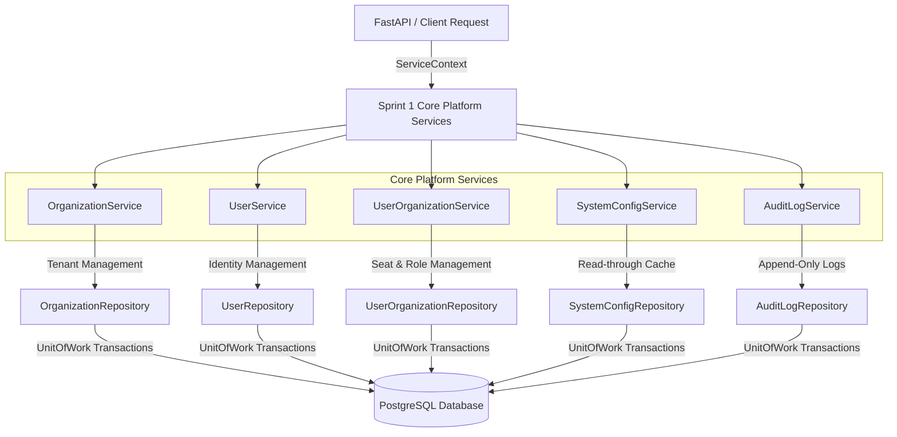

# EAIMOS Sprint 1: Core Platform Service Layer Architecture & Extension Guide

## Executive Summary

Sprint 1 of EAIMOS delivers the **Core Platform Domain Services** built atop the Sprint 0 Base Service Infrastructure. The Core Platform Layer manages Multi-Tenant Organizations, User Identity Profiles, Organization Memberships and Seat Quotas, Global System Configurations, and Append-Only Compliance Audit Logging.

---

## Core Services Architecture

---

## Service Contracts & Functionality

### 1. `OrganizationService`
- **Model**: `Organization`
- **Repository**: `OrganizationRepository`
- **Key Methods**:
  - `create(ctx, dto)`: Validates subscription tier (`free`, `starter`, `professional`, `enterprise`) and enforces unique tenant slug constraints.
  - `get_by_slug(ctx, slug)`: Cached organization lookup by URL-friendly slug.
  - `update_tier(ctx, org_id, new_tier, max_members, max_ai_credits)`: Subscription plan upgrades/downgrades.
  - `get_active_organizations(ctx, limit, offset)`: Admin listing of active organizations.

### 2. `UserService`
- **Model**: `User`
- **Repository**: `UserRepository`
- **Key Methods**:
  - `create(ctx, dto)`: Validates email format and prevents duplicate email registration.
  - `get_by_email(ctx, email)`: Cached user identity lookup.
  - `update_status(ctx, user_id, is_active)`: Deactivate or reactivate user accounts.
  - `verify_email(ctx, user_id)`: Timestamp email verification.

### 3. `UserOrganizationService`
- **Model**: `UserOrganization`
- **Repository**: `UserOrganizationRepository`
- **Key Methods**:
  - `add_member(ctx, dto)`: Checks tenant seat limit against `organization.max_members` before assigning user to organization. Enforces `OWNER`, `ADMIN`, `MEMBER`, `GUEST` roles.
  - `get_org_members(ctx, organization_id)`: List active member assignments in a tenant organization.

### 4. `SystemConfigService`
- **Model**: `SystemConfiguration`
- **Repository**: `SystemConfigRepository`
- **Key Methods**:
  - `create(ctx, dto)`: Prevents duplicate configuration keys per namespace.
  - `get_by_key(ctx, key, namespace)`: Read-through caching for platform configuration settings.

### 5. `AuditLogService`
- **Model**: `AuditLog`
- **Repository**: `AuditLogRepository`
- **Key Methods**:
  - `record_audit_log(ctx, action, entity_type, entity_id, description, details)`: Append-only compliance log entry.
  - `list_by_organization(ctx, organization_id)`: Security audit log querying per organization.

---

## Verification & Test Strategy

All Sprint 1 services are verified via `apps/api/tests/services/sprint1/test_core_platform_services.py` with 100% pass rates across organization lifecycle, user email deduplication, seat quota limits, cached config lookups, and audit logging.
