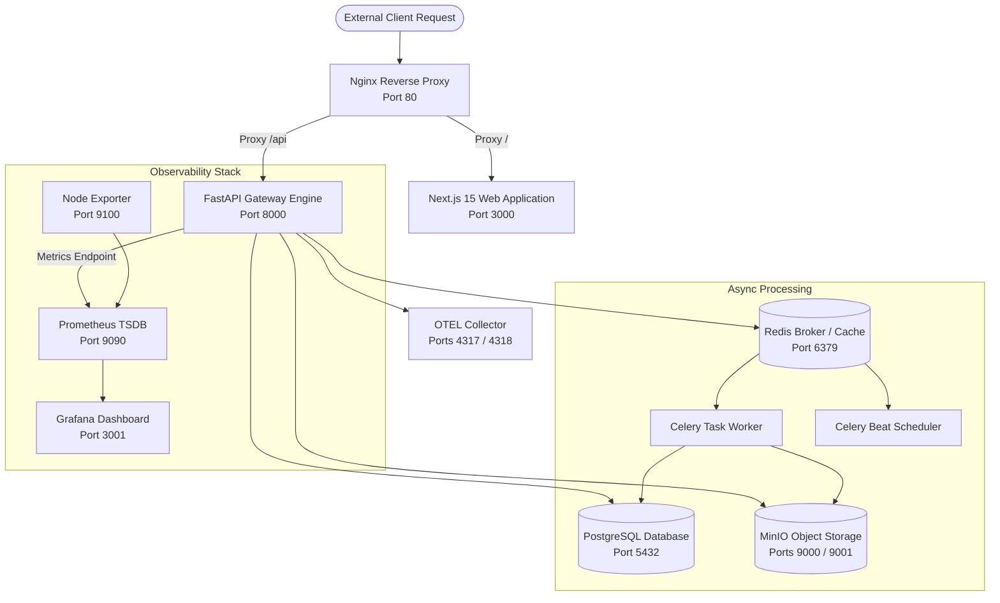

# Infrastructure & Docker Setup

## Overview

The containerized infrastructure of **MarkAI** is managed via **Docker Compose** (`docker-compose.yml`). The stack includes 11 microservice containers spanning data persistence, application runtimes, reverse proxying, telemetry collection, and metrics visualization.

---

## Infrastructure Container Topology

---

## Docker Container Catalog

| Container Name | Base Image / Dockerfile | Exposed Ports | Primary Purpose | Health Check |
| :--- | :--- | :--- | :--- | :--- |
| `eaimos-postgres` | `./infra/docker/postgres/Dockerfile` | `5432` | Relational database (PostgreSQL) | `pg_isready -U postgres` |
| `eaimos-redis` | `redis:7-alpine` | `6379` | Cache manager & Celery broker | `redis-cli ping` |
| `eaimos-minio` | `minio/minio:RELEASE...` | `9000`, `9001` | S3-compatible file object storage | `curl http://localhost:9000/minio/health/live` |
| `eaimos-api` | `./infra/docker/api/Dockerfile` | `8000` | FastAPI ASGI backend gateway | `curl http://localhost:8000/live` |
| `eaimos-worker` | `./infra/docker/api/Dockerfile` | None | Distributed Celery task worker | Inherits container health |
| `eaimos-scheduler` | `./infra/docker/api/Dockerfile` | None | Celery Beat periodic job scheduler | Inherits container health |
| `eaimos-web` | `./infra/docker/web/Dockerfile` | `3000` | Next.js frontend web app | `wget http://localhost:3000/` |
| `eaimos-nginx` | `nginx:1.25-alpine` | `80` | Ingress reverse proxy & SSL wrapper | `wget http://localhost/` |
| `eaimos-prometheus` | `prom/prometheus:v2.52.0` | `9090` | Time-series metrics collection | Internal health check |
| `eaimos-grafana` | `grafana/grafana:11.0.0` | `3001` | System & latency metric dashboards | Internal health check |
| `eaimos-otel-collector`| `otel/opentelemetry-collector-contrib` | `4317`, `4318` | Tracing telemetry collector | Internal health check |
