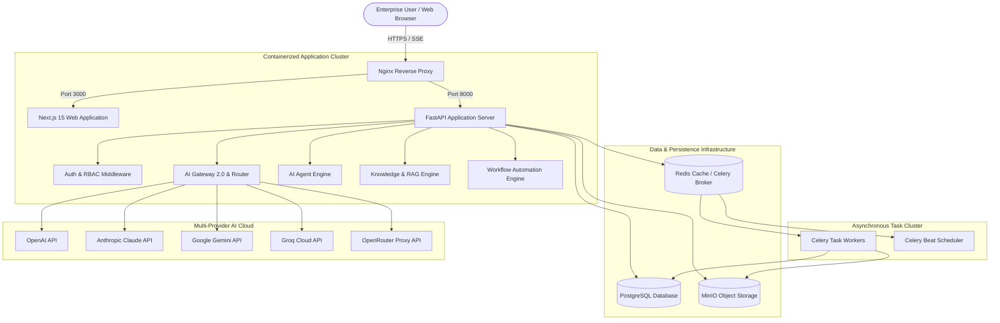
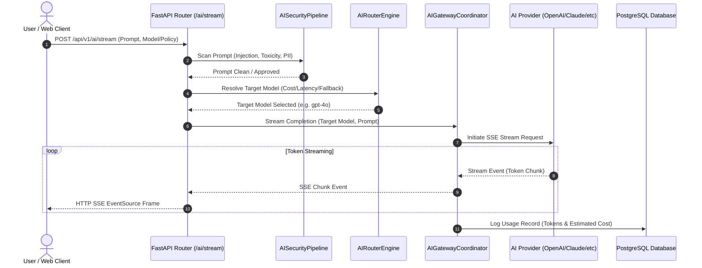
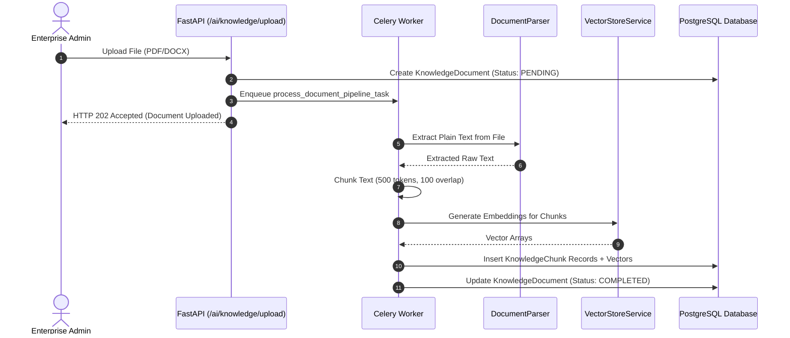

# Visual Architecture & Sequence Diagrams

## 1. High-Level Platform Architecture

---

## 2. Multi-Provider Streaming AI Completion Sequence

---

## 3. Knowledge Document Ingestion & RAG Query Sequence

