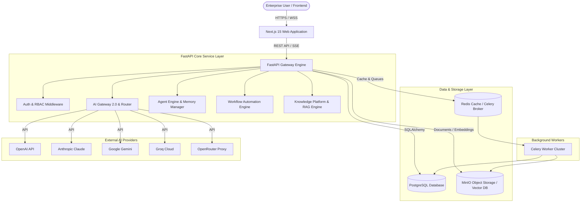

# Executive Summary

## Project Purpose & Vision

**MarkAI** (also referred to as **Enterprise AI Marketing Operating System - EAIMOS**) is an enterprise-ready, multi-tenant AI-powered platform designed to orchestrate marketing workflows, multi-provider LLM inference, autonomous AI agents, knowledge management (RAG), and business analytics.

The platform provides a unified control plane for managing AI provider registries, cost and latency-based LLM routing, prompt management, context-aware agent execution, custom workflows, CRM operations, multi-tenant organization boundaries, and real-time observability.

---

## Current Capabilities

- **AI Gateway 2.0**: Unified proxy engine supporting multi-provider LLM calls across OpenAI, Anthropic Claude, Google Gemini, Groq, and OpenRouter with real-time SSE streaming, rate limiting, budget enforcement, and cost calculation.
- **Enterprise AI Router**: Dynamic fallback and routing engine that directs prompts to optimal models based on latency, cost, and task quality constraints.
- **AI Agent Execution Engine**: Stateful and autonomous agent runtime with multi-step planning (`agent_planner.py`), dynamic execution (`agent_executor.py`), tool usage, and memory persistence (`memory_manager.py`).
- **Knowledge & RAG Platform**: Multi-format document ingestion (`document_parser.py`, `document_processing.py`), chunking, vector storage (`vector_store.py`), and hybrid retrieval (`rag_engine.py`).
- **Workflow Automation**: Graph-based node execution engine (`workflow_engine.py`) supporting trigger conditions, branching logic, retries, and background state evaluation.
- **Security & Multi-Tenancy**: Organization-based RBAC permissions, JWT authentication, encrypted API keys, request sanitization, and PII threat scanning (`security/pipeline.py`).
- **Observability & Analytics**: Integrated OpenTelemetry middleware, Prometheus metrics registry, Redis caching, and real-time usage tracking (`observability.py`).
- **Background Task System**: Distributed worker pipeline powered by Celery and Redis (`worker/celery_app.py`) handling asynchronous document embedding, email delivery, and workflow jobs.

---

## High-Level System Architecture

---

## Technology Stack

### Backend Stack
- **Framework**: Python 3.11+, [FastAPI](https://fastapi.tiangolo.com/) (Async ASGI)
- **Database ORM**: [SQLAlchemy 2.0](https://www.sqlalchemy.org/) with PostgreSQL driver
- **Migrations**: [Alembic](https://alembic.sqlalchemy.org/)
- **Task Queue**: [Celery 5.x](https://docs.celeryq.dev/) + [Redis 7.x](https://redis.io/)
- **Security**: PyJWT, Passlib (Bcrypt), Cryptography (Fernet)
- **Validation**: Pydantic v2 & `pydantic-settings`
- **Observability**: OpenTelemetry SDK, Prometheus Client, Structlog

### Frontend Stack
- **Framework**: [Next.js 15](https://nextjs.org/) (App Router, Server & Client Components)
- **Language**: TypeScript 5.x
- **UI & Styling**: React 19, TailwindCSS 3.x, Lucide React icons
- **State Management**: [Zustand](https://zustand-demo.pmnd.rs/) (`auth`, `ai`, `observability`, `ui`)
- **HTTP Client**: Axios with JWT interlocked interceptors

### Infrastructure & DevOps
- **Containerization**: Docker & Docker Compose (`docker-compose.yml`, `infra/docker/`)
- **Reverse Proxy**: Nginx
- **Metrics & Tracing**: Prometheus, Grafana, OpenTelemetry Collector

---

## Implemented Modules Summary

| Module | Core Purpose | Status | Primary Code Path |
| :--- | :--- | :--- | :--- |
| **Auth & Users** | Multi-tenant organization auth, JWT tokens, RBAC roles | Implemented | [auth.py](file:///d:/markai/apps/api/src/api/routes/auth.py) |
| **AI Gateway 2.0** | Multi-provider streaming coordinator & router | Implemented | [coordinator.py](file:///d:/markai/apps/api/src/api/ai/gateway/coordinator.py) |
| **AI Agents** | Agent runtime, multi-step planner, and tool execution | Implemented | [agent_executor.py](file:///d:/markai/apps/api/src/api/services/agent_executor.py) |
| **Knowledge / RAG** | Vector indexing, hybrid search, document parsing | Implemented | [rag_engine.py](file:///d:/markai/apps/api/src/api/services/rag_engine.py) |
| **Workflows** | Graph execution engine with node condition evaluation | Implemented | [workflow_engine.py](file:///d:/markai/apps/api/src/api/services/workflow_engine.py) |
| **CRM & Campaigns**| Lead management, contacts, companies, campaign flows | Implemented | [crm.py](file:///d:/markai/apps/api/src/api/routes/crm.py) |
| **Security & Guard**| Threat pipeline, prompt injection scanner, rate limits | Implemented | [pipeline.py](file:///d:/markai/apps/api/src/api/ai/security/pipeline.py) |
| **Observability** | Request telemetry, Prometheus metrics, cost audit logs | Implemented | [observability.py](file:///d:/markai/apps/api/src/api/routes/observability.py) |
| **Background Jobs**| Async task execution via Celery workers | Implemented | [celery_app.py](file:///d:/markai/apps/api/src/api/worker/celery_app.py) |

---

## Current Maturity & Completion Estimate

- **Overall Platform Completion**: **85 - 90%**
- **Core Platform Architecture**: **Production-Ready**
- **AI Infrastructure & Multi-Tenancy**: **Production-Ready**
- **Frontend Dashboard Coverage**: **Functional (14 key views implemented)**
- **Technical Debt & Known Gaps**:
  - Vector database relies on mock/in-memory fallback when FAISS/pgvector driver is unconfigured.
  - Integration service currently implements mock connectors for Slack/HubSpot/Salesforce.
  - Frontend UI uses dummy/mock fallbacks when backend API endpoints return empty states.
