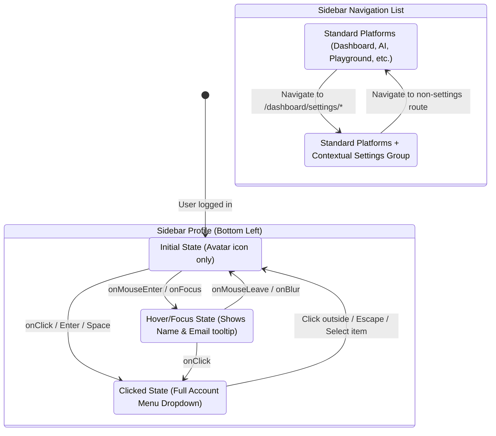

# EAIMOS Account & Settings Navigation Specification

## Overview
This specification details the lifecycle and state transitions for the authenticated user profile and the contextual Settings navigation system.

---

## 1. Interaction State Machine

---

## 2. Route & Ownership Matrix

| Feature | Accessible via | Target Canonical Route | Backend Domain | RBAC Scoping |
| :--- | :--- | :--- | :--- | :--- |
| **Profile / Platform Settings** | Account Menu ➔ Profile Settings | `/dashboard/settings` | User / IAM Backend | All authenticated users |
| **Security & MFA** | Account Menu ➔ Security | `/dashboard/settings/security` | Auth / IAM Backend | User-scoped |
| **Active Sessions** | Account Menu ➔ Active Sessions | `/dashboard/settings/security` | Sessions Backend | User-scoped |
| **Users & Teams** | Account Menu ➔ Users & Teams | `/dashboard/settings/users` | IAM / Core Platform | Admin / Super Admin |
| **Integrations** | Account Menu ➔ Integrations | `/dashboard/settings/integrations` | Integrations Engine | Admin / Super Admin |
| **Sign Out** | Account Menu ➔ Sign Out | `/auth/login` | Auth Token Revocation | All authenticated users |
