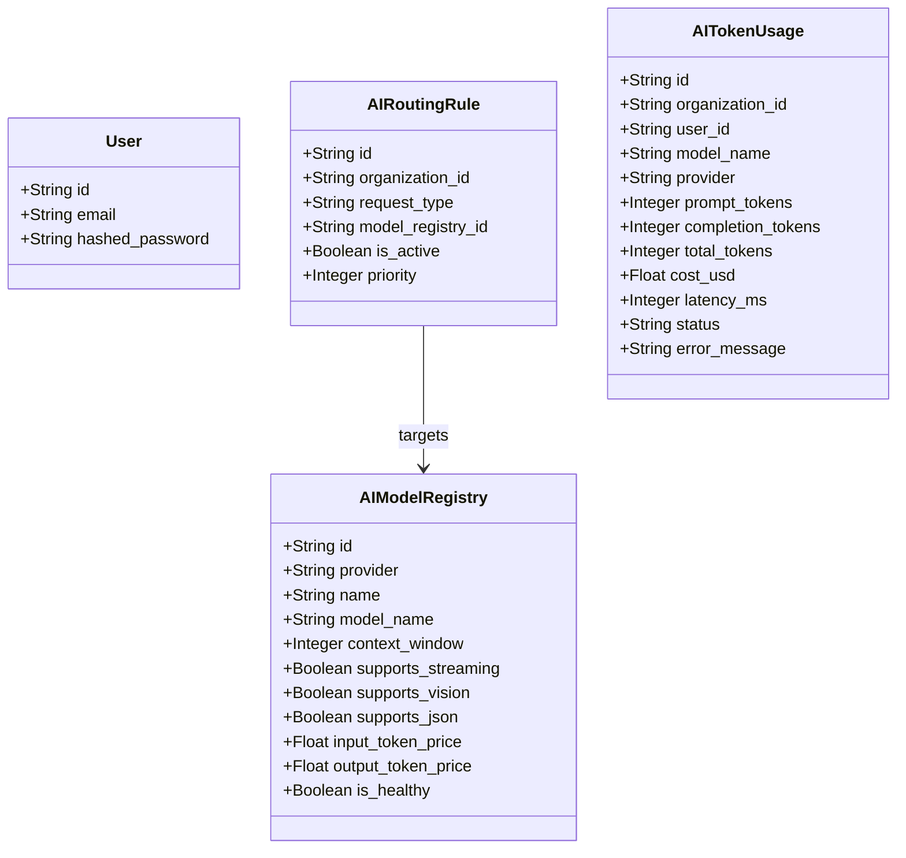

# MarkAI Project Architecture & Core Features Documentation

This document provides a comprehensive overview of the **Viptant / MarkAI Enterprise AI Platform & Marketing Operating System**. It maps out the unified repository architecture, database schemas, backend services, client-side stores, and all the platform dashboard modules implemented up to the current session.

---

## 1. Monorepo Directory Layout

The codebase is organized as a modern monorepo using **npm Workspaces**:

```
d:/markai/
├── apps/
│   ├── api/                   # FastAPI Python backend service
│   │   ├── src/
│   │   │   ├── api/           # Routes, mainstream schemas, core dependencies
│   │   │   ├── database/      # Database engines & session initializers
│   │   │   └── models/        # SQLAlchemy database model registrations
│   │   └── tests/             # Pytest automated test scripts
│   └── web/                   # Next.js React frontend application
│       ├── src/
│       │   ├── app/           # Next.js App Router route pages
│       │   ├── components/    # Common UI elements & components
│       │   ├── features/      # Feature-first modules (e.g. ai-platform)
│       │   ├── layouts/       # Screen containers & layouts
│       │   └── store/         # Zustand global state managers
├── packages/
│   └── shared/                # Common typescript helpers & class utilities
└── docs/                      # Deployment instructions & sprint walkthroughs
```

---

## 2. Unified Technology Stack

### Backend Service (Python / FastAPI)
- **Framework**: **FastAPI** for high-performance, asynchronous REST API endpoints.
- **ORM / DB**: **SQLAlchemy** with transaction session dependencies.
- **Migrations**: **Alembic** database revision systems.
- **Security**: JWT bearer token authentications and password hashing utilities.

### Frontend Client (TypeScript / React / Next.js)
- **Framework**: **Next.js 16** (App Router architecture).
- **Styling**: **Tailwind CSS v4** & **Lucide React** icons.
- **State Management**:
  - **Zustand**: Handles global auth stores (`auth.ts`), sidebar states (`ui.ts`), and filtering states (`ai-platform.ts`).
  - **TanStack Query (React Query)**: Caches server telemetry requests, models list, and routing rules mutations.
- **Charts**: **Recharts** (Area, Bar, Line, Radar charts) for premium telemetry visuals.
- **Animations**: **Framer Motion** for micro-transitions and modal fade-ins.

---

## 3. Database Schema Models

The database contains two core segments: CRM capabilities and the AI platform gateway.



---

## 4. Implemented API Service Routers (`apps/api`)

- **Auth Router (`/auth`)**: Registers tenant namespaces, handles logins, and issues JWT tokens.
- **CRM Router (`/crm`)**: Manages leads, contacts, and companies, isolated by organization headers.
- **AI Models Router (`/ai/models`)**: Lists model registries and allows administrators to toggle health statuses.
- **AI Routing Router (`/ai/routing-rules`)**: Implements CRUD transactions for custom path routing overrides.
- **AI Usage Router (`/ai/usage`)**: Logs token consumption queries and automatically seeds **120 telemetry check records** spanning the last 14 days on load if the logs are empty.

---

## 5. Enterprise AI Platform Features (`apps/web`)

The entire AI platform console is structured under `src/features/ai-platform/`:

### 🔌 Provider Details Page & Wizard (`/dashboard/ai/providers/[id]`)
- **Latency & Availability History**: Area and bar charts plotting latencies and success ratios.
- **Limit Indicators**: Displays real-time RPM/TPM usage metrics.
- **Handshake testing wizard**: Live step-by-step diagnostic test modal verification.

### 📊 Models registry Details (`/dashboard/ai/models/[id]`)
- Displays specifications checklist (vision, json output, tool calling support).
- Includes radar charts displaying reasoning indices (MMLU academic, coding, math logical depths).
- Custom tags configuration cards to assign metadata tags.

### 🧪 Model Comparison Lab (`/dashboard/ai/compare`)
- Allows users to select up to 3 models simultaneously.
- Submits prompts in parallel and renders side-by-side completion panels.
- Displays metrics comparison tables: latency (s), tokens count, tokens per second, and final costs.

### 🎮 AI Playground & Streaming Inspector (`/dashboard/ai/playground`)
- Interactive sidebar prompt editor with custom system parameters and variables extraction.
- **Streaming Inspector tab**: Speedometer calculating live tokens per second, with pause, resume, and reconnect socket controls.

### 📈 Token & Cost Telemetry Analytics (`/dashboard/ai/analytics`)
- **Tokens tab**: KPI dashboards displaying input/output tokens and averages. Visual bar charts representing allocations by user, org, provider, and model, alongside dotted forecast projection lines.
- **Costs tab**: Billing metrics tracking daily, monthly, and forecasted budgets. Features budget sliders to edit alerts and automated savings suggestions.

### 🏥 Provider Uptime Health Center (`/dashboard/ai/health`)
- Displays operational indicators with horizontal checks timeline grids for each provider.
- Includes downtime logs and active incident resolution trails.

### 🔎 Request & Prompt Inspectors
- **Request Inspector tab**: Details trace headers list, payload bodies, latency, and status codes.
- **Prompt Inspector tab**: Displays system prompts, user input, and completion outputs. Integrated directly within logs tables.

### 👑 AI Platform Admin Console (`/dashboard/ai/admin`)
- Allows administrators to inject organization credit limit budgets.
- Features RPM limit sliders and provider API key rotation buttons.
- Records action events inside a trace-audit log.
