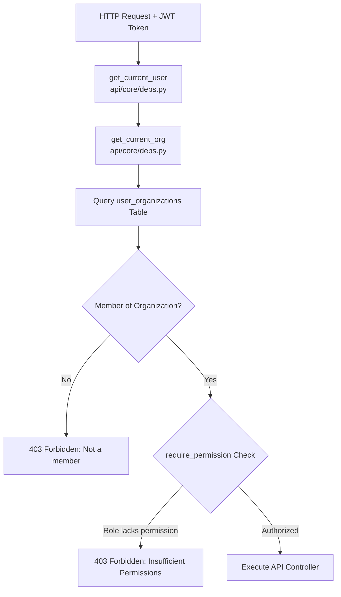

# Security Architecture, Auth, RBAC & Rate Limits

## Overview

Security in **MarkAI** is implemented across multiple defense-in-depth layers: Cryptography & Authentication, Multi-Tenant Isolation, Role-Based Access Control (RBAC), AI Pre/Post Security Scanning, and Usage Rate Limits & Quotas.

---

## 1. Authentication & Token Management

- **Password Cryptography**: Passlib with Bcrypt algorithm for hashing and verifying passwords (`get_password_hash`, `verify_password` in [security.py](file:///d:/markai/apps/api/src/api/core/security.py)).
- **JWT Authentication**:
  - **Access Tokens**: Short-lived tokens (configured by `ACCESS_TOKEN_EXPIRE_MINUTES`, default 7 days) encoding `sub` (User UUID) and `type: "access"`.
  - **Refresh Tokens**: Long-lived tokens (configured by `REFRESH_TOKEN_EXPIRE_MINUTES`, default 30 days) allowing seamless token rotation via `/api/v1/auth/refresh`.

---

## 2. Organization Multi-Tenancy & RBAC

Every API request containing multi-tenant data is validated against the authenticated user's organization membership:

### System Roles & Seeded Permissions

- **`OWNER`**: Organization Owner with all permissions (`manage_users`, `manage_billing`, `create_content`, `view_analytics`).
- **`ADMIN`**: Administrator with management access (`manage_users`, `create_content`, `view_analytics`).
- **`MEMBER`**: Standard Member (`create_content`, `view_analytics`).
- **`GUEST`**: Read-only guest (`view_analytics`).

---

## 3. Data Encryption at Rest

- **Secrets Encryption**: Third-party LLM API keys (OpenAI, Anthropic, Gemini, Groq, OpenRouter) and integration OAuth tokens are encrypted before database insertion using Fernet symmetric encryption ([encryption.py](file:///d:/markai/apps/api/src/api/core/encryption.py)).
- **Key Derive**: Powered by `SECRET_KEY` environment variable setting.

---

## 4. AI Security Pipeline & Threat Scanning

- **Prompt Injection Defense**: Pre-generation scanner detects system instructions override attempts, jailbreak syntax, and unauthorized prompt delimiters.
- **PII Data Leakage Scanning**: Regular expression engines scan outgoing completions and incoming prompts to mask SSNs, credit card numbers, email addresses, and API tokens.
- **Audit Event Logs**: Security violations write event entries to `security_events` table for dashboard reporting.

---

## 5. Rate Limits & Quotas

- **Organization Daily Spend Limit**: System verifies token/spending ceilings configured in `AIOrgLimit`.
- **Daily Quota Reset**: Automatic Celery Beat cron job (`quota_reset_worker_task`) resets daily request, token, and spend counters at midnight UTC.
